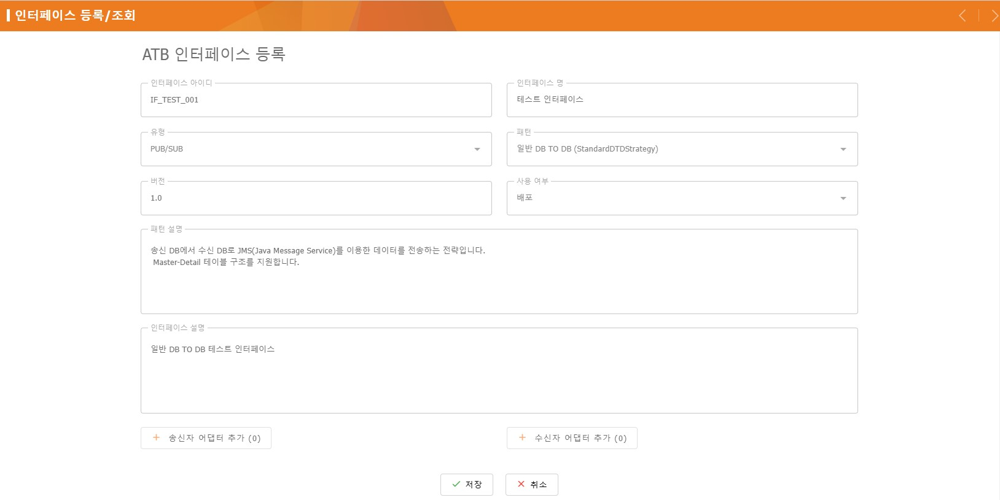

= ATB-WEB User Guide +
Release Version 1.0.2

[.text-right]
Author : 박재현 parkjh@metabuild.co.kr

== 1. ATB-WEB 개요

- ATB(Adaptor Template for SpringBoot)와 상호작용할 수 있는 웹 애플리케이션으로, ATB 관련된 기능을 제공합니다.

== 2. ATB-WEB 패치

- IMC에 ATB-WEB을 다음과 같은 순서로 패치를 제공합니다.

+
xref:shutdown[1. IMC 중지]
+
xref:menu_json[2. menu.json 내용 추가]
+
xref:site_custom_config[3. siteCustomConfig.js 파일 추가]
+
xref:app_copy[4. app 디렉토리 복사]
+
xref:index_app_en[5. index_app-en.html 내용 추가]
+
xref:index_app_ko[6. index_app-ko.html 내용 추가]
+
xref:war_copy[7. atb-web.war 파일 복사]
+
xref:startup[8. IMC 재시작]
+
xref:DBshutdown[9. ATB-WEB DB 설정 변경 전 IMC 종료]
+
xref:application[10. ATB-WEB DB 설정 변경]
+
xref:DBstartup[11. DB 설정 변경 후 IMC 재시작]

=== 2.1. ATB-WEB v1.0.2 패치 적용 방법

[[shutdown]]
==== (1) IMC 중지

IMC를 중지합니다.

[source,bash]
----
imc/bin/shutdown.sh
----

[[menu_json]]
==== (2) menu.json 내용 추가
`imc/webapps/indigoesb/resources/menu.json` 파일에 아래 내용을 추가합니다.

[source,json]
----
{
    "text": "인터페이스 관리",
    "glyph": "fa fa-cog glyphIcon",
    "useYn": "Y",
    "requiredAuth": "SUPER",
    "leaf": false,
    "children": [
        {
            "text": "인터페이스 담당자",
            "glyph": "fa fa-user glyphIcon",
            "viewClass": "PersonPanel",
            "useYn": "Y",
            "requiredAuth": "SUPER"
        },
        {
            "text": "인터페이스 등록/조회",
            "glyph": "fa fa-database glyphIcon",
            "viewClass": "InterfacePanel",
            "useYn": "Y",
            "requiredAuth": "SUPER"
        },
        {
            "text": "ATB CONSOLE",
            "glyph": "fa fa-plug glyphIcon",
            "viewClass": "ConsolePanel",
            "useYn": "Y",
            "requiredAuth": "SUPER"
        }
    ]
}
----

[[site_custom_config]]
==== (3) siteCustomConfig.js 파일 추가
`imc/webapps/indigoesb/resources/` 경로에 제공한 `siteCustomConfig.js` 파일을 추가합니다.

※ siteCustomConfig.js 파일이 이미 존재하는 경우에는 해당 파일에 아래 내용을 추가합니다.

[source, javascript]
----
Ext.onReady(function () {
    IndigoESBWebConsole.app.loadController("IndigoESBWebConsole.controller.atb.InterfaceController");
    IndigoESBWebConsole.app.loadController("IndigoESBWebConsole.controller.atb.ConsoleController");
    IndigoESBWebConsole.app.loadController("IndigoESBWebConsole.controller.atb.PersonController");
});
----

[[app_copy]]
==== (4) app 디렉토리 복사
제공된 `app` 디렉토리를 `imc/webapps/indigoesb/` 경로에 복사합니다.

[source]
----
app
├── controller
│   ├── atb
│   │   ├── ConsoleController.js
│   │   ├── InterfaceController.js
│   │   └── PersonController.js
└── view
    ├── atb
    │   ├── ConsolePanel.js
    │   ├── InterfacePanel.js
    │   └── PersonPanel.js
----

[[index_app_en]]
==== (5) index_app-en.html 추가
`imc/webapps/indigoesb/index_app-en.html` 파일에 아래 스크립트를 추가합니다.

[source,html]
----

----

[index_app-en.html]
[source,html]
----
<!DOCTYPE HTML>
<html>
<head>
    <meta http-equiv="X-UA-Compatible" content="IE=edge">
    <meta charset="UTF-8">
    <link rel="stylesheet" href="resources/IndigoESBWebConsole-all.css"/>
    
    
</head>
<body></body>
</html>
----

[[index_app_ko]]
==== (6) index_app-ko.html 추가
`imc/webapps/indigoesb/index_app-ko.html` 파일에 아래 스크립트를 추가합니다.

[source,html]
----

----

[index_app-ko.html]
[source,html]
----
<!DOCTYPE HTML>
<html>
<head>
    <meta http-equiv="X-UA-Compatible" content="IE=edge">
    <meta charset="UTF-8">
    <link rel="stylesheet" href="resources/IndigoESBWebConsole-all.css"/>
    
    
</head>
<body></body>
</html>
----

[[war_copy]]
==== (7) atb-web.war 파일 복사
제공된 atb-web.war 파일을 `imc/webapps/` 경로에 복사합니다.
[source,bash]
----
cp atb-web.war imc/webapps/
----

[[startup]]
==== (8) IMC 재시작
[source,bash]
----
imc/bin/startup.sh
----

[[DBshutdown]]
==== (9) ATB-WEB DB 설정 변경 전 IMC 종료
[source,bash]
----
imc/bin/shutdown.sh
----

[[application]]
==== (10) ATB-WEB DB 설정 변경
`imc/webapps/atb-web/WEB-INF/classes/application.yml` 파일에서 필요한 datasource 설정을 주석 해제합니다.

※ 현재는 Derby와 Oracle을 지원하고 있습니다.

* (테이블 생성 스크립트는 `imc/webapps/atb-web/WEB-INF/classes/script` 에 있습니다.)

----
#  datasource:
#    driver-class-name: org.apache.derby.jdbc.ClientDriver
#    url: jdbc:derby://127.0.0.1:1527/indigoesb;
#    username: indigo
#    password: indigo
#  sql:
#   init:
#     mode: always
#     schema-locations: classpath:script/derby/ATB_CREATE.SQL

#  datasource:
#    driver-class-name: oracle.jdbc.OracleDriver
#    url: jdbc:oracle:thin:@127.0.0.1:41521:xe
#    username: tester
#    password: tester1234
#  sql:
#    init:
#      mode: always
#      schema-locations: classpath:script/oracle/ATB_CREATE.SQL
----

[[DBstartup]]
==== (11) DB 설정 변경 후 IMC 재시작
- application.yml 파일에서 설정한 datasource 정보에 맞게 테이블을 생성합니다.
[source,bash]
----
imc/bin/startup.sh
----

== 3. ATB-WEB 구성

- ATB-WEB는 다음과 같은 기능을 제공합니다.

=== 3.1. 인터페이스 관리

- 인터페이스 등록

- 인터페이스 조회

- 인터페이스 수정

- 인터페이스 삭제

=== 3.2. 인터페이스 담당자 관리

- 담당자 등록

- 담당자 조회

- 담당자 수정

- 담당자 삭제

=== 3.3. ATB Console

- ATB Adaptor 상호작용 기능 제공

== 4. ATB-WEB 사용법

=== 4.1. 인터페이스 관리

==== 4.1.1. 인터페이스 등록

- 인터페이스 조회 페이지에서 추가 버튼을 클릭하여 인터페이스 등록 페이지로 이동합니다.

- ATB 유형과 패턴을 선택합니다.

* ATB 유형 : ATB Adaptor의 유형을 선택

* ATB 패턴 : 선택한 유형에 따라 패턴을 설정

- PUB/SUB 패턴 (송신자 / 수신자)

- TCP/IP 패턴 (프로바이더)

- 배치 패턴 (배치)

- 프로바이더 패턴 (프로바이더 / 리모트)

- 필수 항목을 입력합니다.

- 인터페이스 등록 페이지에서 어댑터 추가 버튼을 클릭합니다.

- 어댑터 추가 페이지에서 어댑터를 검색하고 선택합니다.

- 탬플릿 내용을 확인하고 커스텀할 부분을 수정하고 저장 버튼을 클릭합니다.

- 어댑터가 정상적으로 등록되었는지 확인합니다.

- 위에 같이 어댑터를 등록하고 저장 버튼을 클릭합니다.

- 정상적으로 저장되었는지 확인합니다.

- 저장된 인터페이스를 확인합니다.

==== 3.1.2. 인터페이스 조회

대소문자 구분 없이 검색어를 입력하면 실시간으로 필터링하여 조회할 수 있습니다.

- 인터페이스 ID로 조회

image::./img/atb-web/atb_web_조회1.jpg[인터페이스 조회 페이지]

- 어댑터 ID로 조회

==== 4.1.3. 인터페이스 수정

- 인터페이스 조회 페이지에서 원하는 인터페이스를 클릭하여 수정 페이지로 이동합니다.

- 일부 항목(인터페이스 ID, 유형, 패턴 설정값)은 수정할 수 없으며, 나머지 정보는 변경 가능합니다.

- 저장된 어댑터 설정을 수정 및 삭제 할 수 있습니다.

- 어댑터 삭제 확인 후 저장 버튼을 클릭합니다.

- 수정된 내용을 확인하고 취소 버튼을 눌러 수정된 내용을 확인합니다.

==== 4.1.4. 인터페이스 삭제

- 인터페이스 조회 페이지에서 삭제할 인터페이스를 선택합니다.

image::./img/atb-web/atb_web_삭제1.jpg[삭제할 인터페이스 선택]

- 삭제 버튼을 클릭합니다.

- 삭제 여부를 확인하는 알림창이 나타납니다.

- 정상적으로 삭제 되었는지 확인합니다.

- 삭제된 인터페이스를 확인합니다.

=== 4.2. 인터페이스 담당자 관리

==== 4.2.1. 인터페이스 담당자 등록

- 인터페이스 담당자 페이지에서 추가 버튼을 클릭하여 담당자 등록 페이지로 이동합니다.

- 담당자 등록 시 *표시된 필수 항목을 입력합니다.

- 다른 정보를 입력하고 저장 버튼을 클릭합니다.

- 등록된 인터페이스를 조회합니다.

- 등록된 인터페이스를 검색 및 선택합니다.

- 인터페이스 추가 버튼을 클릭합니다.

- 인터페이스가 등록되었는지 확인하고 저장 버튼을 클릭합니다.

- 등록된 담당자를 확인합니다.

image::./img/atb-web/atb_web_담당자_등록8.jpg[담당자 등록 확인]

==== 4.2.2. 인터페이스 담당자 조회

대소문자 구분 없이 검색어를 입력하면 실시간으로 필터링하여 조회할 수 있습니다.

- 등록된 담당자를 인터페이스 ID, 기관/기업명, 담당부서, 담당자명, 연락처, 이메일, 설명을 기준으로 검색할 수 있습니다.

- 인터페이스 ID를 기준으로 만들어둔 테스터 인터페이스를 검색합니다.

==== 4.2.3. 인터페이스 담당자 수정

- 담당자 조회 페이지에서 수정할 담당자 명을 클릭하여 수정 페이지로 이동합니다.

- 저장된 담당자 정보를 확인합니다.

- 수정할 내용을 입력합니다.

- 담당자 인터페이스를 삭제합니다.

- 수정한 내용을 저장합니다.

- 담당자 조회 페이지에서 수정된 내용을 확인합니다.

==== 4.2.4. 인터페이스 담당자 삭제

- 담당자 조회 페이지에서 삭제할 담당자를 선택합니다.

- 삭제 버튼을 클릭합니다.

image::./img/atb-web/atb_web_담당자_삭제2.jpg[삭제 버튼 클릭]

- 담당자 조회 페이지에서 삭제된 담당자를 확인합니다.

=== 4.3. ATB Console

==== ATB Console은 엔지니어가 장애 대응 및 유지보수를 위해 개발되었습니다.

※ IMC를 통해 원격으로 Adaptor에 접근하여 대상 Adaptor의 점검 및 모니터링을 지원합니다.

- ATB Console 페이지로 이동합니다.

- ATB Console 페이지에서 Agent를 선택합니다.

- Agent를 선택 후 Adaptor를 선택합니다.

image::./img/atb-web/atb_web_console3.jpg[Adaptor 선택]

- Agent와 Adaptor를 모두 선택하고 연결 버튼을 클릭합니다.

- 선택한 Adaptor를 Console 창으로 연결합니다. (username, password / adaptor의 .properties 파일에 설정한 값)

image::./img/atb-web/atb_web_console6.jpg[password 입력]

- Adaptor와 연결된 Console 창이 나타납니다.

- Console 창에서 help 명령어를 입력하여 사용 가능한 명령어를 확인할 수 있습니다.

    * Dashboard : 실행 Thread 목록 , JVM 설정, JVM Memory , GC 모니터링
    * Net : 네트워크 방화벽 점검
    * Thread : Thread Dump 분석, Thread Dashboard , Thread List
    * Date : 서버 설정된 시간을 리턴합니다.

