= ATB(Adaptor Template for SpringBoot) Dev Guide +
 Release Version 1.0.2

[.text-right]
Author : clupine <clupine@metabuild.co.kr>

== 1. ATB DEV?

ATB는 (Adaptor Template for SpringBoot)를 이용하는 개발자를 대상으로 커스터마이징이나 패턴 개발을 위한 개발가이드 입니다.

== 2. 개발환경 구성하기

. 개발툴 (InteliJ IDEA or Eclipse)
. JDK 1.8
. 제공 되는 ATB 소스를 Maven 프로젝트로 IMPORT

== 3. ATB PACKAGE 구성

ATB는 다음과 같은 패키지로 구성되어 있습니다.

|===
| 패키지명 | 설명
| mb.fw.atb | ATB의 기본 패키지
| mb.fw.atb.appender | log4j appender 관련
| mb.fw.atb.config | application.yml에 설정된 설정값을 읽어오는 클래스
| mb.fw.atb.configuration | Bean 등록을 위한 패키지
| mb.fw.atb.constant | 상수 패키지
| mb.fw.atb.controller | REST API를 위한 RestController 패키지
| mb.fw.atb.cxf.interceptor | CXF 웹서비스 Interceptor 패키지
| mb.fw.atb.enums |  열거형 패키지
| mb.fw.atb.error |  에러 관련 패키지
| mb.fw.atb.job |  소규모 Job을 위한 패키지
| mb.fw.atb.listener |  JMS Listener 패키지
| mb.fw.atb.model |  DTO(Data Transfer Object) 모델 패키지
| mb.fw.atb.parser | 파싱을 위한 패키지
| mb.fw.atb.schedule | 스케줄링을 위한 패키지
| mb.fw.atb.service | 서비스 패키지
| mb.fw.atb.strategy | 연계 패턴 개발을 위한 패키지
| mb.fw.atb.util | 유틸리티 패키지
| org.crsh | ATB Console 관련 CRaSH Customizing 패키지
| mb.fw.transformation | TCP/IP 전문 변환 모듈
|===

== 3. 주요 클래스

ATB의 주요 클래스는 다음과 같습니다.

|===
| 클래스명 | 설명
| mb.fw.atb.AtbApplication | ATB 의 메인(시작) 클래스
| mb.fw.atb.aop.TimeTrace | @타임 트레이스 Annotation
| mb.fw.atb.aop.TimeTraceAspect | TimeTrace의 Aop Aspect 클래스
| mb.fw.atb.appender.ESBMQAppender | 오류가 발생하면 ESB MQ 로 전송 하기 위한 log4j appender 클래스
| mb.fw.atb.build.ATBSpecBuild | ATB의 스펙을 빌드하는 클래스 (maven compile 단계에서 수행)
| mb.fw.atb.build.CrashCommandsBuild | CRaSH Command 명령어 목록을 생성하는 클래스 (maven compile 단계에서 수행)
| mb.fw.atb.config.IFConfig | Application.yml 파일의 설정값을 읽어오는 클래스
| mb.fw.atb.config.Specifications | strategy 의 스펙을 정의하는 클래스
| mb.fw.atb.config.SpecDirection | Specifications 의 하위 설정 클래스이며 송신자 또는 수신자의 Json String 을 정의합니다.
| mb.fw.atb.config.FieldsSchema | Specifications 의 하위 설정 클래스이며 Json String 의 필드 스키마를 정의합니다.
| mb.fw.atb.config.sub.EmbeddedNetworkAdaptor | IFConfig 의 하위 설정 클래스이며 내장 네트워크 어댑터 설정값이 들어갑니다.
| mb.fw.atb.config.sub.Gpki | IFConfig 의 하위 설정 클래스이며 공인인증서 설정값이 들어갑니다.
| mb.fw.atb.config.sub.IFContext | IFConfig 의 하위 설정 클래스이며 인터페이스 설정값이 들어갑니다.
| mb.fw.atb.config.sub.IFResult | IFConfig 의 하위 설정 클래스이며 Provider의 결과(리턴)에 대한 설정입니다.
| mb.fw.atb.config.sub.Iftp | IFConfig 의 하위 설정 클래스이며 파일전송 설정값이 들어갑니다.
| mb.fw.atb.config.sub.RemoteNetworkAdaptor | IFConfig 의 하위 설정 클래스이며 원격 네트워크 어댑터 설정값이 들어갑니다.
| mb.fw.atb.configuration.IFTPConfiguration | 파일 전송 모듈을 생성합니다.
| mb.fw.atb.configuration.MessageQueueConfig | PUB/SUB 유형에서 각종큐 (DATA , RESULT , RESEND) 리스너를 생성합니다.
| mb.fw.atb.configuration.NetworkAdaptorConfig | 네트워크 어댑터 모듈을 생성합니다.
| mb.fw.atb.configuration.SecurityConfig |  Rest Provider의 보안 설정을 위한 클래스
| mb.fw.atb.constant.ATBPrefix | ATB의 설정 Prefix 를 정의합니다.(소스 내부에서 사용합니다.)
| mb.fw.atb.controller.ATBRestController | ATB 의 RestController 클래스 , 각종 인터페이스 REST API 호출을 처리합니다.
| mb.fw.atb.controller.NARestController |  Network Adapter 통신을 위한 RestController 클래스 TCP/IP 통신 API 를 제공합니다.
| mb.fw.atb.cxf.interceptor.Base64DecInterceptor | CXF 웹서비스 Interceptor 클래스(Base64 디코딩)
| mb.fw.atb.cxf.interceptor.Base64EncInterceptor | CXF 웹서비스 Interceptor 클래스(Base64 인코딩)
| mb.fw.atb.cxf.interceptor.ShareGPKIDecInterceptor | CXF 웹서비스 Interceptor 클래스(행공 전용 공인인증서 복호화)
| mb.fw.atb.cxf.interceptor.ShareGPKIEncInterceptor | CXF 웹서비스 Interceptor 클래스(행공 전용 공인인증서 암호화)
| mb.fw.atb.enums.ActionType | ATB의 액션 타입을 정의합니다.
| mb.fw.atb.enums.FileType | 파일 유형을 정의합니다.
| mb.fw.atb.enums.THeader | ATB의 프로퍼티 Key를 담고 있습니다.
| mb.fw.atb.enums.TResult | ATB의 결과 코드를 정의합니다.
| mb.fw.atb.error.ATBException | ATB의 예외 클래스
| mb.fw.atb.error.ErrorCode | ATB의 에러 코드를 정의합니다.
| mb.fw.atb.job.com.ToJMSData | JMS로 데이터를 전송하기 위한 클래스
| mb.fw.atb.job.file.DirectoryPolling | 파일 처리 관련 : 디렉토리 폴링을 위한 클래스
| mb.fw.atb.job.file.FileOnMessageResult | 파일 처리 관련 : 파일 수신 결과를 처리하기 위한 클래스
| mb.fw.atb.job.file.FileRecvJob | 파일 처리 관련 : 파일 수신을 위한 클래스
| mb.fw.atb.job.file.IFTPJob | 파일 처리 관련 : 파일 전송을 위한 클래스
| mb.fw.atb.job.file.SuccessMove | 파일 처리 관련 : 파일 수신 성공시 이동을 위한 클래스
| mb.fw.atb.job.file.TempMove | 파일 처리 관련 : 파일 수신후 Temp로 이동을 위한 클래스
| mb.fw.atb.listener.DataListener | PUB/SUB 유형에서 데이터를 수신하기 위한 리스너
| mb.fw.atb.listener.ResendListener | PUB/SUB 유형에서 재전송을 위한 리스너
| mb.fw.atb.listener.ResultListener | PUB/SUB 유형에서 결과를 수신하기 위한 리스너
| mb.fw.atb.model.OnSignalInfo | 송신 또는 배치 스케줄에 의한 이벤트를 처리하기 정보를 담고 있습니다.
| mb.fw.atb.model.data.DBMessage | DB 연계를 위한 (DTO) 클래스
| mb.fw.atb.model.file.FileMessage | 파일 전송을 위한 (DTO) 클래스
| mb.fw.atb.model.file.FileInfo | FileMessage 에 포함된 파일 정보를 담고 있습니다.
| mb.fw.atb.model.file.FileDataError | FileInfo 에 포함된 에러 정보를 담고 있습니다.
| mb.fw.atb.parser.ATBParser | ATB의 파서를 위한 추상 클래스(코드 베이스 파싱용)
| mb.fw.atb.parser.SHineSCIParser | JSON(Map) to ASCII(전문) 상호간 파서 클래스(샘플로 남겨둡니다.)
| mb.fw.atb.schedule.ScheduleRunnable |  스케줄링을 위한 Runnable 클래스
| mb.fw.atb.schedule.TaskSchedulingService | 스케줄링을 taskScheduler 관리 클래스
| mb.fw.atb.service.NAOutboundSendAsyncService | 비동기 호출을 위한 서비스 인터페이스
| mb.fw.atb.service.DBTransactionService | DB 트랜잭션 처리를 위한 서비스 인터페이스
| mb.fw.atb.service.DBTransactionServiceImpl | DB 트랜잭션 처리를 위한 서비스 기본 구현클래스
| mb.fw.atb.service.NAInboundAsyncService | 내장 네트워크 어댑터의 INBOUND 처리
| mb.fw.atb.service.NAInboundToHttpService | 리모트 네트워크 어댑터의 INBOUND 처리
| mb.fw.atb.strategy.ATBStrategy | ATB 의 전략 패턴을 위한 추상 클래스 이며 상속받아서 각종 연계 패턴을 구현합니다.
| mb.fw.atb.strategy.batch.FileMoveStrategy | 배치 연계 : 파일 이동 처리
| mb.fw.atb.strategy.batch.FTIDBKeyGenManagerStrategy | 배치 연계 : 금융결제원의 금융거래정보 중계업무 관련(샘플로 남겨둠)
| mb.fw.atb.strategy.batch.FTIGC00SendStrategy | 배치 연계 : 금융결제원의 금융거래정보 중계업무 관련(샘플로 남겨둠)
| mb.fw.atb.strategy.batch.FTIGC01RecvStrategy | 배치 연계 : 금융결제원의 금융거래정보 중계업무 관련(샘플로 남겨둠)
| mb.fw.atb.strategy.batch.StandardFTDBatch | 배치 연계 : 표준 파일 TO DB 연계 패턴을 구현한 클래스
| mb.fw.atb.strategy.na.StandardNetworkAdaptorStrategy | 네트워크 어댑터 연계 패턴을 구현한 클래스
| mb.fw.atb.strategy.provider.PoliceIssuingStrategy | 프로바이더 연계 : 경찰청 무인발급기 관련(샘플로 남겨둠)
| mb.fw.atb.strategy.provider.StandardDBDeleteStrategy | 프로바이더 연계 : 테이블 삭제
| mb.fw.atb.strategy.provider.StandardDBInsertStrategy | 프로바이더 연계 : 테이블 삽입
| mb.fw.atb.strategy.provider.StandardDBSelectStrategy | 프로바이더 연계 : 테이블 조회
| mb.fw.atb.strategy.provider.StandardDBUpdateStrategy | 프로바이더 연계 : 테이블 업데이트
| mb.fw.atb.strategy.provider.StandardRSTRCPOSTStrategy | 프로바이더 연계 : REST TO REST CALL(샘플로 남겨둠)
| mb.fw.atb.strategy.pubsub.StandardDFTFDStrategy | PUB/SUB 연계 : 대용량 DB TO DB 연계 패턴을 구현한 클래스
| mb.fw.atb.strategy.pubsub.StandardDTDStrategy | PUB/SUB 연계 : DB TO DB 연계 패턴을 구현한 클래스
| mb.fw.atb.strategy.pubsub.StandardFTFDStrategy | PUB/SUB 연계 : 파일 TO DB 연계 패턴을 구현한 클래스
| mb.fw.atb.strategy.pubsub.StandardFTFStrategy | PUB/SUB 연계 : 파일 TO 파일 연계 패턴을 구현한 클래스
| mb.fw.atb.util.DateUtils | 날짜 관련 유틸리티
| mb.fw.atb.util.ESBProductEncryption | ESB 제품 암호화 유틸리티
| mb.fw.atb.util.ATBUtil | 로깅 유틸리티
| mb.fw.atb.util.MDCLogging | MDC 로깅 유틸리티
| mb.fw.atb.util.OkHttpUtil | OkHttp 유틸리티
| mb.fw.atb.util.PathComparatorUtil | 경로 비교
| mb.fw.atb.util.TransactionIdGenerator | 트랜잭션 ID 생성
| mb.fw.atb.util.crypto.AnsiX923Padding | 암호화 패딩
| mb.fw.atb.util.crypto.ARIACipher | ARIA 암호화
| mb.fw.atb.util.crypto.ARIAEngine | ARIA 암호화
| mb.fw.atb.util.crypto.Base64 | Base64 암호화
| mb.fw.atb.util.crypto.CryptoPadding | 암호화 패딩
| mb.fw.atb.util.crypto.CryptoType | 암호화 유형
| mb.fw.atb.util.crypto.DataCryptographyStrategy | 데이터 암호화 전략 유틸리티
| mb.fw.atb.util.crypto.FTICryptoUtil | 금융결제원 금융거래정보관련 암호화
| mb.fw.atb.util.crypto.Seed128Cipher | SEED 암호화
| mb.fw.atb.util.crypto.SEED_KISA | SEED 암호화
| mb.fw.atb.util.crypto.kisa.KISA_SEED | SEED 암호화
| mb.fw.atb.util.crypto.kisa.KISA_SEED_CBC | SEED 암호화(CBC)
| mb.fw.atb.util.crypto.kisa.KISA_SEED_CCM | SEED 암호화(CCM)
| mb.fw.atb.util.crypto.kisa.KISA_SEED_CMAC | SEED 암호화(CMAC)
| mb.fw.atb.util.crypto.kisa.KISA_SEED_CTR | SEED 암호화(CTR)
| mb.fw.atb.util.crypto.kisa.KISA_SEED_ECB | SEED 암호화(ECB)
| mb.fw.atb.util.crypto.kisa.KISA_SEED_GCM | SEED 암호화(GCM)
| mb.fw.atb.util.gpki.NewGpkiUtil | 행공에서 사용하는? 공인인증서(신) 유틸리티
| mb.fw.atb.util.gpki.ShareGpki | 행공에서 사용하는? 공인인증서(구) 유틸리티
|===

== 4. ATB 의 구성요소

ATB의 핵심 구성요소는 크게 다음과 같습니다.

=== 4.1 SCHEDULE(스케줄링)

배치 스케줄링을 위해 사용되는 클래스는 다음과 같습니다.

|===
| 클래스명 | 설명
| mb.fw.atb.schedule.ScheduleRunnable |  스케줄링을 위한 Runnable 클래스
| mb.fw.atb.schedule.TaskSchedulingService | 스케줄링을 taskScheduler 관리 클래스
|===

NOTE: 배치와 송신 스케줄 관리를 위한 클래스 입니다. +
인터페이스에 등록된 cron 표현식에 따라 ScheduleRunnable 스케줄링을 수행합니다. +
ScheduleRunnable 은 ATBStrategy를 상속받아 구현한 클래스의 인터페이스 메소드인 onSignal()을 실행합니다. +

=== 4.2 LISTENER(리스너)

JMS 리스너를 위해 사용되는 클래스는 다음과 같습니다.

|===
| 클래스명 | 설명
| mb.fw.atb.listener.DataListener | PUB/SUB 유형에서 Receiver가 JMS 데이터를 수신하기 위한 리스너
| mb.fw.atb.listener.ResendListener | PUB/SUB 유형에서 Sender 또는 Batch가 재전송을 하기 위한 리스너
| mb.fw.atb.listener.ResultListener | PUB/SUB 유형에서 Sender가 JMS 결과를 수신하기 위한 리스너
|===

NOTE: 1. PUB/SUB 유형에서 각종큐 (DATA , RESULT , RESEND) 리스너를 생성합니다. +
2. mb.fw.atb.configuration.MessageQueueConfig 에서 각종큐 (DATA , RESULT , RESEND) 리스너를 생성합니다. +

=== 4.3 REST CONTROLLER(Provider)

ATB에서는 REST API를 위한 제공되는 RestController 클래스는 다음과 같습니다.

|===
| 클래스명 | 설명
| mb.fw.atb.controller.ATBRestController | ATB 의 RestController 클래스 , 각종 인터페이스 REST API 호출을 처리합니다.
| mb.fw.atb.controller.NARestController | Network Adapter 통신을 위한 RestController 클래스 TCP/IP 통신 API 를 제공합니다.
|===

NOTE: 용도에 따라 Provider와 Strategy를 분리할수도 통합할수도 있습니다.(Direct 방식 , Remote 방식)

=== 4.4 JOB(잡)

 연계에 필요한 재사용 가능한 공통적이거나 기능적인 클래스를 Job 패키지안에서 만들고 Strategy 내에서 사용하도록 구현하세요.
 Strategy 내에서 Job과 또다른 Job을 사용하여 연계 비즈니스를 수행하도록 그런 의도로 디자인하였습니다.

=== 4.5 ATBStrategy (연계 패턴 구현을 위한 추상 클래스)

 ATBStrategy.class는 연계 패턴을 구현해야할 클래스 입니다.
ATBStrategy.class를 상속 하고 추상 메소드를 구현하여 각종 연계 패턴을 구현합니다.

==== 4.5.1 ATBStrategy 클래스 분석

[source,java]
----
include::../../src/main/java/mb/fw/atb/strategy/ATBStrategy.java[SQL_IF_FTD_001.xml]
----

ATBStrategy 클래스는 다음과 같은 추상 메소드를 가지고 있습니다.

|===
| 메소드명 | 설명
| OnSignalInfo onSignal | 송신 또는 배치 스케줄에 의한 이벤트, 주로 데이터를 발생시키는 영역입니다.
| OnSignalInfo onSignalRetry | 송신 또는 배치 재전송 이벤트에 발생되며 재전송을 위한 데이터를 발생시킵니다.
| Object onMessageData | Pub/Sub 유형에서는 송신자로부터 메시지를 받는 수신 이벤트이며 , Provider 유형에서는 요청 데이터를 받는 이벤트입니다.
| Object onMessageResult | Pub/Sub 유형에서 수신자로부터 결과 메시지를 처리하는 송신자측 이벤트입니다.
| Specifications specifications | 인터페이스 관리 페이지 연동을 위한 IMC 에 노출되는 스펙을 정의합니다.
|===

==== 4.5.2 PUB/SUB 유형의 메소드 이벤트

PUB/SUB 유형의 메소드 이벤트는 다음과 그림과 같이 동작합니다.

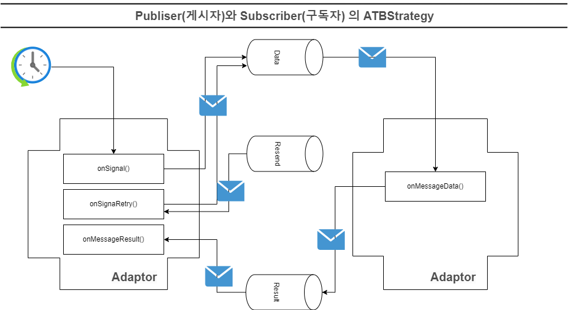

NOTE: 1. 스케줄에 의한 onSignal()이 실행이 되고 데이터를 생성(발행)하여 DATA 큐로 전송합니다. +
2. Data 큐로 부터 수신하게 되면 onMessageData()가 실행이 되어 데이터를 처리합니다.  +
3. 처리된 결과 정보를 RESULT 큐로 전송합니다. +
4. RESULT 큐로 부터 수신하게 되면 onMessageResult()가 실행이 되어 결과를 처리합니다. +
5. 재전송은 Resend 큐로부터 재전송할 정보를 수신하게 되면 onSignalRetry()가 실행이 되어 재전송을 진행합니다.

PUB/SUB Diagram::
다음은 실제 구현된 PUB/SUB 유형의 연계 패턴의 다이어그램 입니다.

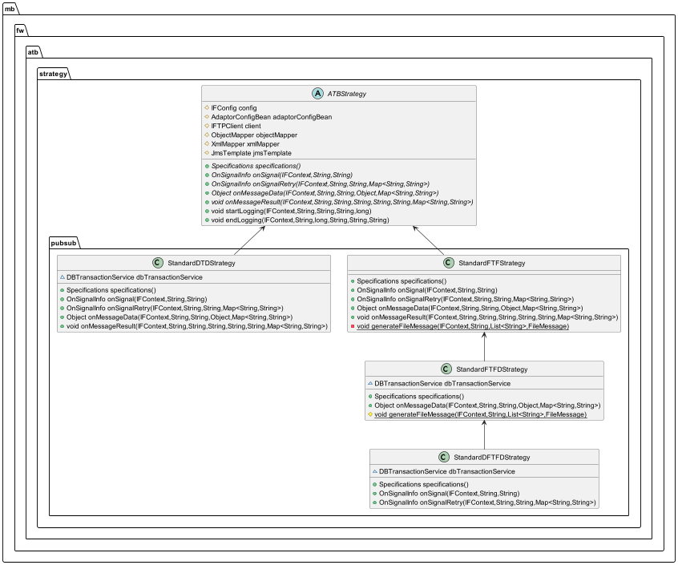

==== 4.5.3 Provider 유형의 메소드 이벤트

Provider 유형의 메소드 이벤트는 다음과 그림과 같이 동작합니다.

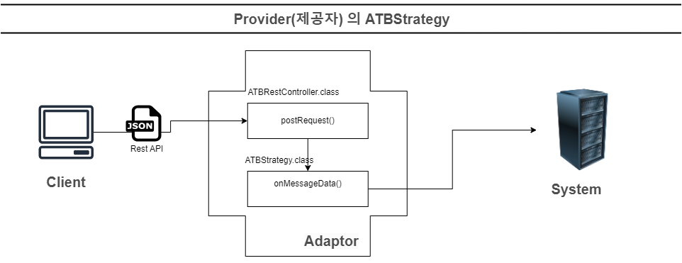

NOTE: 1. 프로바이더 페턴은 Rest API를 통하여 ATBRestController의 postRequest 메소드를 경유합니다. +
2. postRequest를 경유하여 ATBStrategy의 onMessageData() 메소드가 실행이 되어 데이터를 처리합니다.

Provider Diagram::
다음은 실제 구현된 Provider 유형의 연계 패턴의 다이어그램 입니다.

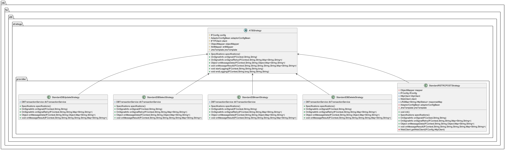

=== 4.4 Batch 유형의 메소드 이벤트

Batch 유형의 메소드 이벤트는 다음과 그림과 같이 동작합니다.

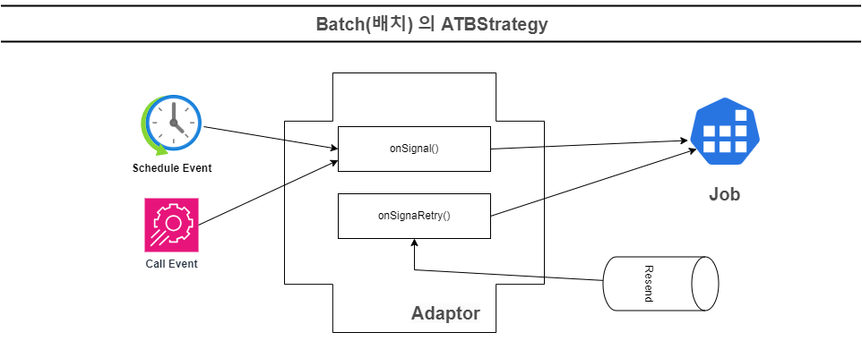

Batch Diagram::
다음은 실제 구현된 Batch 유형의 연계 패턴의 다이어그램 입니다.

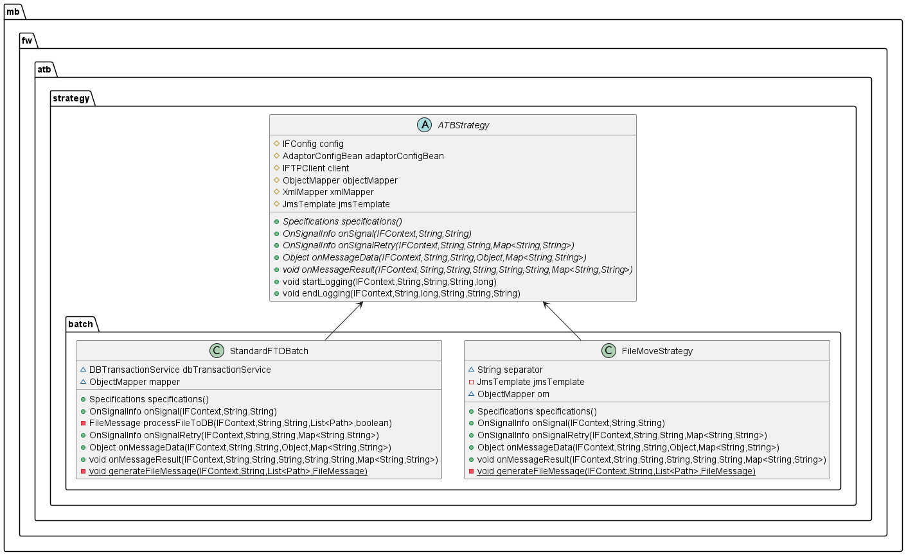

== 5. 패턴 구현 예제

 ATBStrategy를 상속받아 각종 연계 패턴을 구현해보겠습니다.

=== 5.1 PUB/SUB 유형의 연계 패턴 구현

1) pub/sub 패키지에 ExamplePubSubStrategy.java 를 생성하고 ATBStrategy를 상속합니다.

[source,java]
----
public class ExamplePubSubStrategy extends ATBStrategy {

}

----

2) ExampleStrategy.java 에 구현 해야할 메소드 를 오버 라이드 합니다.

[source,java]
----

    @Override
    public Specifications specifications() {
        return null;
    }

    @Override
    public OnSignalInfo onSignal(IFContext context, String txid, String eventDt) throws Exception {
        return null;
    }

    @Override
    public OnSignalInfo onSignalRetry(IFContext context, String txid, String msgCreDt, Map<String, String> propMap) throws Exception {
        return null;
    }

    @Override
    public Object onMessageData(IFContext context, String txid, String eventDt, Object data, Map<String, String> propMap) throws Exception {
        return null;
    }

    @Override
    public void onMessageResult(IFContext context, String txid, String eventDt, String resultCode, String resultMessage, String dataStr, Map<String, String> propMap) throws Exception {

    }

----

3) onSignal()을 구현 합니다. onSignal은 데이터를 발생시키고 발생시킨 데이터를 OnSignalInfo 객체에 담아 리턴합니다.

[source,java]
----
    @Override
    public OnSignalInfo onSignal(IFContext context, String txid, String eventDt) throws Exception {

        /**
         * 필요한 정보는 IFConfig , IFContext 및 상위 파라메터로부터 가져올수 있습니다.
         */
        String transactionId = txid;
        String initTime = eventDt;
        String interfaceId = context.getInterfaceId();
        String sendSystemCode = context.getSendSystemCode();
        String receiveSystemCode = context.getReceiveSystemCode();

        String id = config.getId();
        String address = config.getAddress();

        String sendJson = "{\"test\":\"test\"}";

        OnSignalInfo onSignalInfo = OnSignalInfo.builder().count(1).sendObject(sendJson).build();
        return onSignalInfo;
    }
----

NOTE: 1. application.yml에 설정한 설정정보는 IFContext 변수인 context와 IFConfig 변수인 config를 통하여 원하는 값을 가져올수 있습니다. +
2. Sender(송신자)와 수신자(Receiver)간의 데이터를 주고 받을때는 json String으로 주고 받아야 합니다. +
3. 데이터를 Object로 송신할경우는 자동으로 Json String으로 변환되어 전송합니다.. +
4. OnSignalInfo에 발생된 데이터 Count와 데이터를 담아 리턴합니다. +
5. 보낼 데이터가 없을때는 null을 리턴하거나 count를 0으로 주면 그대로 종료가 됩니다.

4) onSignal에서 발생된 데이터는 JMS를 통하여 DATA 큐로 전송이 되고 DATA 큐로 부터 수신자(Receiver)가 수신하게 되면 onMessageData()가 실행이 되어 데이터를 처리해야합니다.

5) onMessageData()를 구현합니다.
예제는 데이터를 처리했다 가정하고 송신자(Sender)에 회신할 약속된 데이터형으로 반환합니다.

[source,java]
----
       @Override
    public Object onMessageData(IFContext context, String txid, String eventDt, Object data, Map<String, String> propMap) throws Exception {

        String jsonStr = (String) data;
        log.info("onMessageData : {}", data);

        String returnJson = "{\"test2\":\"test2\"}";

        return returnJson;
    }
----

NOTE: 1. 만약 처리중 오류(Exception)가 발생하면 예외 던짐(throws Exception)으로 인하여 IMC 연계 이력에 실패로 기록 되며 오류 회신만 송신자에게 큐를 통해 전달이 되고 +
2. 정상인경우는 IMC 연계 이력에 정상으로 기록이 되고 회신이 송신자에게 큐를 통해 전달됩니다. +
3. 만약 연계 이력에 실패도 필요하고 송신자(Sender)에게 회신할 데이터가 필요가 있을때는 ATBException에 returnJson을 포함하고 예외 던지기(throw ATBException)를 하세요

6) onMessageData()에서 회신된 데이터는 JMS를 통하여 RESULT 큐로 전송이 되고 RESULT 큐로 부터 송신자(Sender)가 수신하게 되면 onMessageResult()가 실행이 되어 결과를 처리해야합니다.

7) onMessageResult()를 구현합니다.
예제는 결과를 처리했다 가정하고 종료합니다.

[source,java]
----
      @Override
    public void onMessageResult(IFContext context, String txid, String eventDt, String resultCode, String resultMessage, String dataStr, Map<String, String> propMap) throws Exception {

        log.info("onMessageResult : {}", dataStr);
        log.info("resultCode : {}", resultCode);
        log.info("resultMessage : {}", resultMessage);
        TResult result = TResult.fromValue(resultCode);
        switch (result) {
            case SUCCESS:
                log.info("SUCCESS");
                break;
            case FAIL:
                log.info("FAILURE");
                break;
        }

    }
----

NOTE: 1. 결과코드는 'S' , 'F' , 'P' 가 있으며 각각 성공 , 실패 , 처리중 으로 구분합니다. +
2. propMap(프로퍼티 정보)은 JMS 메시지의 property값 포함되어 주고 받습니다. 그러므로 onMessageData나 onMessageResult에서 담아서 회신할수 있습니다. +
3. data에 포함하고 싶지 않는 정보를 회신하고 싶다면 propMap을 이용하세요.

=== 5.2 Provider 유형의 연계 패턴 구현

1) provider 패키지에 ExampleProviderStrategy.java 를 생성하고 ATBStrategy를 상속합니다.

[source,java]
----
public class ExampleProviderStrategy extends ATBStrategy {

}
----

2) ExampleProviderStrategy.java 에 구현 해야할 메소드 를 오버 라이드 합니다.[소스 코드 생략]

3) Provider는 RestController로부터 onMessageData을 호출하기 때문에 onMessageData()만 구현하면 됩니다.

4) onMessageData()를 구현합니다.
예제는 데이터를 처리했다 가정하고 송신자(Sender)에 회신할 약속된 데이터 형인 Map으로 반환합니다.

[source,java]
----
    @Override
    public Object onMessageData(IFContext context, String txid, String eventDt, Object data, Map<String, String> propMap) throws Exception {

        Map dataMap = null;
        // NONE,JMS 방식이냐에 따라 String JSON 또는 Map으로 데이터로 수신
        if (data instanceof String) {
            dataMap = objectMapper.readValue((String) data, Map.class);
        } else {
            dataMap = (Map) data;
        }
        log.info("onMessageData : {}", dataMap);
        Map<String, String> retMap = new HashMap<>();
        //응답할 데이터를 만들고
        retMap.put("aaa","111");
        retMap.put("bbb","222");
        String msgRcvDt = DateUtils.today17();
        propMap.put(THeader.RECEIVER_ID.key(), config.getId());
        propMap.put(THeader.RECEIVER_STRATEGY.key(), context.getStrategy(
        ));
        propMap.put(THeader.RECEIVER_MSG_RECV_DT.key(), msgRcvDt);
        propMap.put(THeader.RECEIVER_ADAPTOR_NAME.key(),
                adaptorConfigBean.getAdaptorName());
        propMap.put(THeader.RECEIVER_RESULT_CD.key(), TResult.SUCCESS
                .value());
        propMap.put(THeader.RECEIVER_RESULT_MSG.key(), "SUCCESS");
//응답할 인터페이스 결과 정보를 포함
        retMap.put(THeader.IF_RESULT.key(), propMap.toString());
        return retMap;
    }

----

NOTE: 1. RestController를 통하여 데이터를 받을때 Map 또는 String Json 으로 받기 때문에 데이터를 Map으로 변환하여 처리합니다. +
2. 응답할 데이터를 만들고 propMap에 응답할 인터페이스 결과 정보를 포함하여 리턴합니다. +
3. RestController에서는 이력 로그를 남기기 위하여 인터페이스 결과 정보를 활용합니다.

=== 5.3 Batch 유형의 연계 패턴 구현

1) batch 패키지에 ExampleBatchStrategy.java 를 생성하고 ATBStrategy를 상속합니다.

[source,java]
----
public class ExampleBatchStrategy extends ATBStrategy {

}
----

2) ExampleBatchStrategy.java 에 구현 해야할 메소드 를 오버 라이드 합니다.[소스 코드 생략]

3) Batch는 스케줄에 의해 onSignal()을 호출하기 때문에 onSignal()만 구현하면 됩니다.

4) onSignal()을 구현합니다. onSignal은 데이터를 발생시키고 발생시킨 데이터를 OnSignalInfo 객체에 담아 리턴합니다.

[source,java]
----
    @Override
    public OnSignalInfo onSignal(IFContext context, String txid, String eventDt) throws Exception {

         //TODO : 연계패턴 구현
        String resultCode;
        String resultMessage;
        int errorCount;
        try {
            resultMessage = "SUCCESS";
            resultCode = "S";
            int dataCount = 1;
            errorCount = 0;
            String receiverId = "RECEIVER_ID";
            //시작 이력 기록
            String sendDt = eventDt;
            startLogging(context, txid, eventDt, sendDt, dataCount);
        } catch (Exception e) {
            resultCode = "F";
            resultMessage = e.getMessage();
            errorCount = 1;
        }
        //종료 로그 기록
        log.info("onSignal : {} , {}", resultCode, resultMessage);
        endLogging(context, txid, errorCount, context.getReceiverIds()[0], resultCode,
                resultMessage);
        //반드시 Batch의 경우에는 ProcessEnd를 true로 주세요
        return OnSignalInfo.builder().count(1).processEnd(true).build();
   }
----

NOTE: 1. Batch의 경우에는 ProcessEnd를 true로 주세요 +
2. Batch의 경우에는 시작과 종료시에 로깅을 해야합니다. +

== 6. 인터페이스 관리를 위한 스펙 정의

ATB에서는 인터페이스 관리를 위한 스펙을 정의할수 있습니다. 스펙을 정의하고 빌드된 프로젝트의 설정파일(atbPattern.json)을 업로드하면 인터페이스 관리 메뉴의 인터페이스 등록/조회에 신규 개발 패턴이 추가됩니다.
_#v1.0.2 부터 지원합니다.#_

=== 6.1 스펙 정의

==== 6.1.1 Specifications 예제

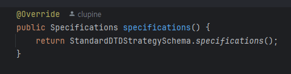

NOTE: 1.ATBStrategy를 상속받아 구현한 클래스에서 스펙을 정의합니다. +
2. 구현하지 않고 null을 리턴할 경우에는 인터페이스 등록/조회에 개발했던 패턴이 노출되지 않습니다.

==== 6.1.2 Specifications 구성

===== _Specifications.java_

- 이름과 한글명,버전,설명과 json Example을 정의합니다.
- FieldsSchema 는 송신자와 수신자를 구분하여 json 설정에 들어갈 스키마 정보를 포함합니다.

[source,java]
----
include::../../src/main/java/mb/fw/atb/config/Specifications.java[Specifications.java]
----

===== _FieldsSchema.java_

- 현재 인터페이스 등록/조회의 환경설정을 Text Area에 입력받고 있으나, 향후 FieldsSchema를 활용하여 Input Form을 제공할 예정입니다.

[source,java]
----
include::../../src/main/java/mb/fw/atb/config/FieldsSchema.java[FieldsSchema.java]
----

==== 6.1.3 인터페이스 관리 페이지 등록

  ATB 프로젝트를 maven install을 하면 src/main/resources/atbPattern.json 파일이 생성됩니다.
이 파일을 IMC의 배포 디렉토리에 업로드하면 인터페이스 관리 페이지에 개발된 패턴이 등록이 됩니다.

===== _atbPattern.json_ upload
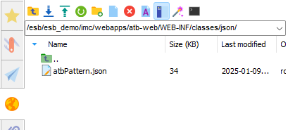

===== 인터페이스 등록/조회 -> 생성-> 유형(선택) -> 노출되는 패턴 확인
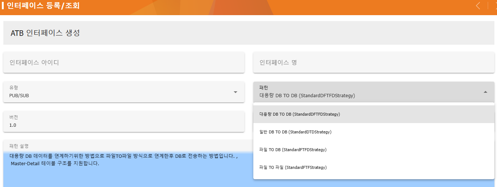

== 7. 개발환경에서 구동 및 관리 방안

=== 7.1 Maven 빌드

  - Maven을 install 을 하면 target 디렉토리에 atb-1.0.2.jar 과 atb-1.0.2-original.jar 파일이 생성됩니다.

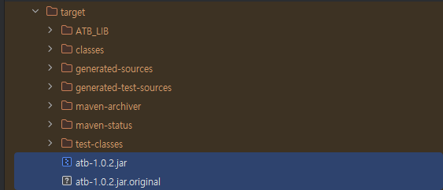

  - atb-1.0.2.jar는 의존되는 라이브러리가 포함되는 실행 가능한 JAR 파일입니다.
  - atb-1.0.2-original.jar는 라이브러리를 포함하지 않는 JAR 파일입니다.
  - ESB Agent 에는 라이브러리를 등록시 atb-1.0.2-original.jar 파일을 등록합니다.

CAUTION: 라이브러리 추가시에 AGENT의 CLASSPATH에 등록하면 안됩니다.

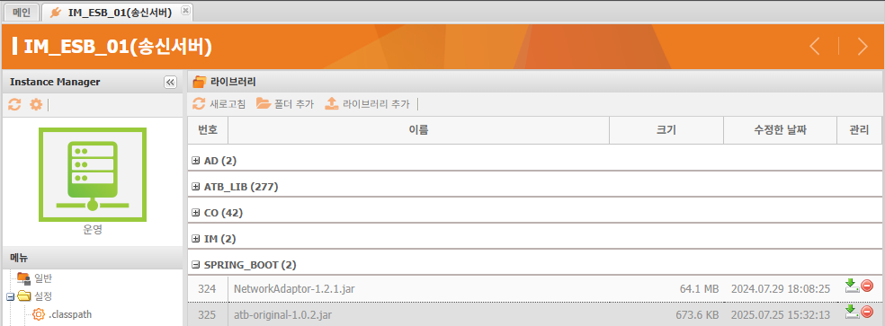
  - 라이브러리는 agent/libs/ATB_LIB란 폴더에 관리됩니다.

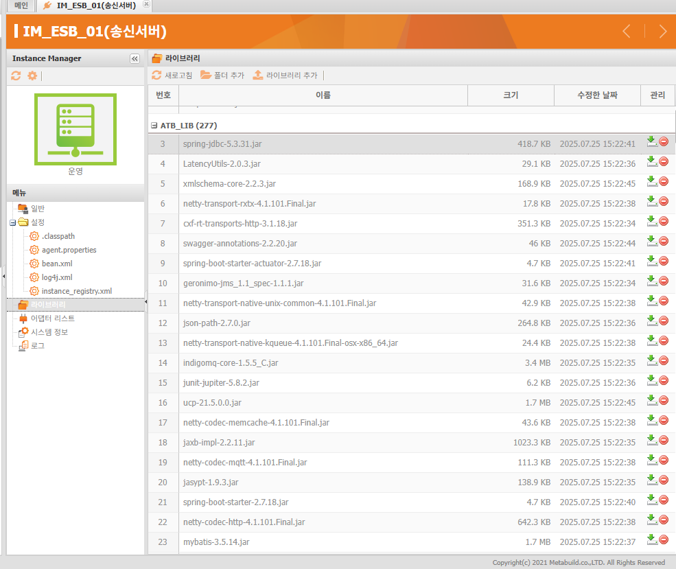
  - 라이브러리는 빌드할때 Target/ATB_LIB 폴더에 생성됩니다.

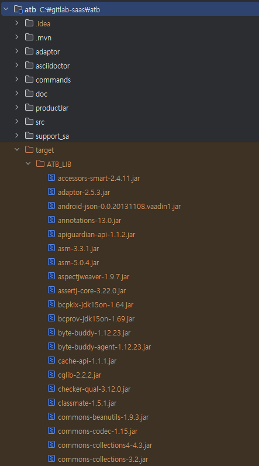

=== 7.2 구동
==== 7.2.1 사전준비
classpath의 위치인 src/main/resources 경로에 설정 파일을 포함시킵니다.

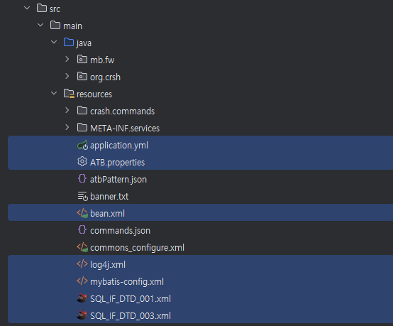
==== 7.2.2 구동 <Eclipse or InteliJ>
mb/fw/atb/AtbApplication.java 파일을 실행하면 ATB가 구동됩니다.
[source,java]
----
include::../../src/main/java/mb/fw/atb/AtbApplication.java[AtbApplication.java]
----

===== 7.2.3 Adaptor 구동
자바 옵션을 추가합니다. (LINUX/UNIX 예제)

 -cp '../../libs/SPRING_BOOT/atb-original-1.0.2.jar:../../libs/ATB_LIB/*:../configure/ATB_DTD_S_01' mb.fw.atb.AtbApplication

자바 옵션을 추가합니다. (WINDOWS 예제)

 -cp "../../libs/SPRING_BOOT/atb-original-1.0.2.jar;../../libs/ATB_LIB/*;../configure/ATB_DTD_S_01" mb.fw.atb.AtbApplication

NOTE: ATB_DTD_S_01 는 어뎁터의 ID 입니다.

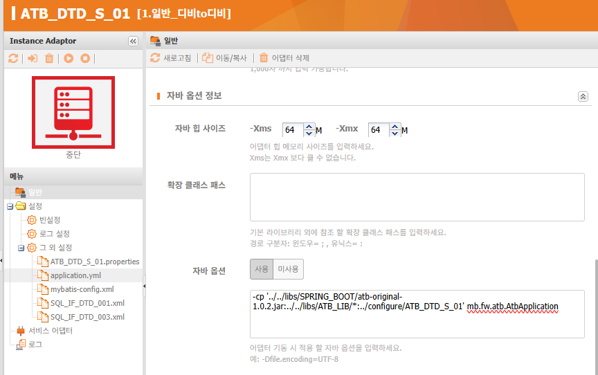

