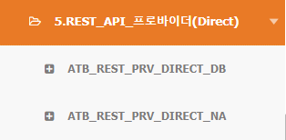

= ATB(Adaptor Template for SpringBoot) User Guide +
 Release Version 1.0.0

[.text-right]
Author : clupine <clupine@metabuild.co.kr>

== 1. ATB란?

ATB란 Adaptor Template for SpringBoot의 약자로 SpringBoot를 이용하여 개발을 할 때 자주 개발되는 연계 패턴을 정리하여 템플릿으로 제공하는 것을 목적으로 합니다.

== 2. 연계 패턴

ATB는 다음과 같은 연계패턴으로 구성 으로 되어 있습니다.

[cols="1,2,3"]
|===
| 순번 | 구성요소 | 설명
| 1 | 일반 DB TO DB | 송신 DB에서 수신 DB로 데이터를 전송하는 연계
| 2 | 대용량 DB TO DB | 송신 DB에서 수신 DB로 처리과정을 대용량을 처리할수있도록 파일로 변환하여 전송하는 연계
| 3 | FILE TO FILE | 송신 서버의 저장소 디렉토리에서 수신 서버의 저장소 디렉토리로 파일을 전송하는 연계
| 4 | FILE TO DB | 송신 서버의 저장소 디렉토리에서 수신 서버의 저장소 디렉토리로 파일을 전송하고 수신 서버의 DB로 데이터를 전송하는 연계
| 5 | FILE TO DB 배치 | 송수신 서버를 분리하지 않고 디렉토리에서 파일을 읽어서 디비로 전송하는 배치 방식 연계
| 6 | REST PROVIDER(DB) | REST Server에서 수신한 데이터를 DB로 CRUD(Create, Read , Update , Delete)처리 하는 연계 (Remote , Direct DB) 방식으로 구성
| 7 | REST PROVIDER(Remote DB) |  위의 구성에서 Provider와 DB 처리 영역을 어뎁터별로 분리되어 연계를 합니다.
| 8 | REST PROVIDER(TCP/IP) | REST Server에서 수신한 데이터를 TCP/IP로 전송하는 연계 , TCP/IP통신 모듈 (NetworkAdaptor)와의 연동 (Remote , Direct) 방식으로 구성
| 9 | REST PROVIDER(Remote TCP/IP) | 위의 구성에서 Provider와 TCP/IP 처리 영역을 어뎁터별로 분리되어 연계를 합니다.
|===

NOTE: 패턴은 향후 다양해집니다.

== 3. ATB의 특징

ATB는 다음과 같은 특징이 있습니다.

* Spring Boot을 기반으로 개발되어 있어서 Spring Boot의 모든 기능을 사용할 수 있습니다.
* 설정 간소화
* 재처리 기능
* 파일 전송모듈 : IFTP를 사용하여 파일을 전송
* TCP/IP : TCP/IP 통신모듈인 NetworkAdaptor 내장
* 인터페이스별 스케줄링
* 연계 이력 : 개량된 Single Route SA를 사용하여 로그에 기록
* 스케줄링 이중화 기능 구현(Acive/Acive , Active/Standby)

== 4. ATB Adaptor 유형

이번장에서는 ATB의 어댑터에 유형에 대해서 설명합니다.

=== 4.1 Pub/Sub 방식

어댑터는 Publiser(게시자)와 Subscriber(구독자)로 구분되어 연계를 수행합니다.

TIP: 연계 패턴 DB TO DB , DB TO FILE , FILE TO FILE , FILE TO DB은 Pub/Sub 구조로 되어 있습니다.

=== 4.2 Provider

어댑터는 제공자가 되어서 데이터를 제공하는 역할을 합니다.

TIP: 연계 패턴 Rest API Provder(Direct) , (Remote) 가 Provider 구조로 되어 있습니다.

=== 4.3 Batch

어댑터는 배치로 구동되어서 연계를 수행합니다.

TIP: 연계 패턴 DB TO DB 송신, DB TO FILE 송신 및 Batch , FILE TO FILE 송신 , FILE TO DB 송신 구현부에서 Batch 구조로 되어 있습니다.

== 5. ATB DEMO

ATB DEMO는 본 가이드의 시연및 교육를 목적으로 미리 설정된 어댑터 환경을 제공하고 직접 사용하고 체험하여 ATB의 연계 패턴의 기능을 익힐 수 있도록 구성되어 있습니다.
본 개발가이드는 DEMO를 기준으로 설명합니다.

=== 5.1 DEMO의 설치 & 구동

. 제공받은 DEMO 파일을 압축을 해제하여 ESB DEMO를 구동합니다.
. http://127.0.0.1:24050/indigoesb 로 접속하여 로그인 합니다.
. admin / qwer1234!@#$ 으로 로그인 합니다.

=== 5.2 프로젝트의 목록

NOTE:  프로젝트를 어댑터를 패턴별과 용도별로 분리를 하였습니다

== 6 일반 디비to디비

=== 6.1 개요

일반 DB TO DB 어댑터는 송신과 수신어댑터로 구성되어있으며 구체적인 처리 동작과 설정을 다룹니다.

=== 6.2 일반 디비to디비 처리 구성도

NOTE:  송신어댑터는 스케줄 이벤트에따라 +
1. 출발지(Source) DB 테이블을 Polling(조회)한후 조회한 데이터를 +
2. 연계상태 컬럼을 진행중(P)으로 업데이트하고 +
3. ESB MQ(MessageQueue) DATA 큐로 전송합니다. +
★ 수신어댑터는 ESB MQ(MessageQueue)인 DATA 큐로 부터 +
4. Polling(조회)된 데이터를 수신하고 +
5. 대상(Target) DB 테이블에 INSERT를 한후 +
6. 옵션에 따라 프로시저를 호출 합니다. +
7. 수행 처리 결과를 ESB MQ(MessageQueue)인 RESULT 큐로 전송합니다. +
★ 송신어댑터는 +
8. 처리결과를 ESB MQ(MessageQueue)로부터 수신하고 +
9. 처리결과를 출발지(Source) DB 테이블에 UPDATE합니다.

=== 6.3 ATB_DTD_S_01 : 일반 디비to디비  (송신)

* 필수 공통 리소스
DataSource:: 데이터베이스 연결을 위한 DataSource , id를 dataSource로 등록하면 자동 Injection
JmsConnectionFactory:: JMS 설정 (jmsTemplate 포함) , id를 jmsConnectionFactory로 등록하면 자동 Injection

* 필수 설정 파일

application.yml:: 어플리케이션 설정 파일

[source,yml]
----
include::../../TEMPLATE/config/ATB_DTD_S_01/application.yml[application.yml]
----

[options="header"]
.atb.if-config
|===
| Key                | Value           | Detail
| id                 | ex) DTD_SENDER_01   | ATB 식별 ID
| description        | ex) "(DB SENDER) + JMS + (DB RECEIVER)" | 연계 설명
| prefix             | ex) DTD             | 식별자
|===

[options="header"]
.atb.if-config.context
|===
| Key             | Value              | Detail
| interfaceId     | ex) IF_DTD_001           | 인터페이스 ID
| actionType      | SENDER, RECEIVER   | 액션 타입
| strategy        | ex) StandardDTDStrategy| 전략 컴포넌트 ID
| cronExpression  | ex) 0/20 * * * * ?     | 스케줄 CRON 문법
| on-signal-loop  | true, false               | 데이터가 존재할 경우 반복 여부 (default : false)
| send-system-code| ex) A01                   | 송신 시스템 코드(이력용)
| receive-system-code | ex) B01               | 수신 시스템 코드(이력용)
| receiver-ids    | ex) DTD_RECEIVER_01       | 수신자 ATB 식별 ID
|===

[options="header"]
.spring.main
|===
| Key                           | Value     | Detail
| web-application-type          | none, reactive, servlet        | web-application 을 포함하지 않을경우 none으로 입력합니다.
| allow-bean-definition-overriding | true, false    | 구동시에 bean이 같은 id가 존재할경우 오버라이딩 할건지에 대한 내용이며 이중화 관련 재기동 동작기능이 포함되어있어서 해당옵션을 true로 고정합니다.
|===

[options="header"]
.mybatis
|===
| Key               | Value           | Detail
| config-location    | ex) classpath:mybatis-config.xml | mybatis 설정파일 경로를 지정합니다.
|===

mybatis-config.xml:: Mybatis 설정 파일

[source,xml]
----
include::../../TEMPLATE/config/ATB_DTD_S_01/mybatis-config.xml[mybatis-config.xml]
----

TIP: SQL문을 설정으로 관리하기위하여 Mybatis를 사용하는데 필요한 설정파일입니다. 인터페이스가 추가될때마다 mapper를 추가합니다.

SQL_IF_DTD_001.xml:: Mybatis 설정 파일

[source,xml]
----
include::../../TEMPLATE/config/ATB_DTD_S_01/SQL_IF_DTD_001.xml[SQL_IF_DTD_001.xml]
----

TIP: namespace는 인터페이스 ID를 넣고 SELECT , SELECT_RESEND, UPDATE, RESULT_UPDATE 를 추가합니다.

=== 6.4 ATB_DTD_R_01 : 일반 디비to디비 (수신)

* 필수 공통 리소스
DataSource:: 데이터베이스 연결을 위한 DataSource , id를 dataSource로 등록하면 자동 Injection
JmsConnectionFactory:: JMS 설정 (jmsTemplate 포함) , id를 jmsConnectionFactory로 등록하면 자동 Injection

* 필수 설정 파일

application.yml:: 어플리케이션 설정 파일

[source,yml]
----
include::../../TEMPLATE/config/ATB_DTD_R_01/application.yml[application.yml]
----

[options="header"]
.atb.if-config
|===
| Key                | Value           | Detail
| id                 | ex) DTD_RECEIVER_01   | ATB 식별 ID
| description        | ex) "(DB SENDER) + JMS + (DB RECEIVER)" | 연계 설명
| prefix             | ex) DTD             | 식별자
|===

[options="header"]
.atb.if-config.context
|===
| Key             | Value              | Detail
| interfaceId     | ex) IF_DTD_001           | 인터페이스 ID
| actionType      | SENDER, RECEIVER   | 액션 타입
| strategy        | ex) StandardDTDStrategy| 전략 컴포넌트 ID
|===

[options="header"]
.atb.if-config.context
|===
| Key             | Value              | Detail
| interfaceId     | ex) IF_DTD_001           | 인터페이스 ID
| actionType      | SENDER, RECEIVER   | 액션 타입
| strategy        | ex) StandardDTDStrategy| 전략 컴포넌트 ID
| cronExpression  | ex) 0/20 * * * * ?     | 스케줄 CRON 문법
| on-signal-loop  | true, false               | 데이터가 존재할 경우 반복 여부 (default : false)
| send-system-code| ex) A01                   | 송신 시스템 코드(이력용)
| receive-system-code | ex) B01               | 수신 시스템 코드(이력용)
| receiver-ids    | ex) DTD_RECEIVER_01       | 수신자 ATB 식별 ID
|===

[options="header"]
.spring.main
|===
| Key                           | Value     | Detail
| web-application-type          | none, reactive, servlet        | web-application 을 포함하지 않을경우 none으로 입력합니다.
| allow-bean-definition-overriding | true, false    | 구동시에 bean이 같은 id가 존재할경우 오버라이딩 할건지에 대한 내용이며 이중화 관련 재기동 동작기능이 포함되어있어서 해당옵션을 true로 고정합니다.
|===

[options="header"]
.mybatis
|===
| Key               | Value           | Detail
| config-location    | ex) classpath:mybatis-config.xml | mybatis 설정파일 경로를 지정합니다.
|===

mybatis-config.xml:: Mybatis 설정 파일

[source,xml]
----
include::../../TEMPLATE/config/ATB_DTD_R_01/mybatis-config.xml[mybatis-config.xml]
----

TIP: SQL문을 설정으로 관리하기위하여 Mybatis를 사용하는데 필요한 설정파일입니다. 인터페이스가 추가될때마다 mapper를 추가합니다.

SQL_IF_DTD_001.xml:: Mybatis 설정 파일

[source,xml]
----
include::../../TEMPLATE/config/ATB_DTD_R_01/SQL_IF_DTD_001.xml[SQL_IF_DTD_001.xml]
----

TIP: namespace는 인터페이스 ID를 넣고 INSERT와 CALL문을 추가합니다.
송신(Sender) 에서 발송한 데이터의 키를 Value에 입력합니다.
DB to DB같은경우는 송신 DB의 컬럼이 될것입니다. +
transactionId(트랜젝션 ID),receiverMsgRecvDt(수신처리시간),interfaceId(인터페이스ID)는 ATB 에서 고정된 예약된 값으로 사용됩니다.

=== 6.5 재처리 기능

- IMC / 메시지 이력관리 / 송수신 메시지 조회 / 메시지 상세정보 / 실패한 목적지 아이디를 선택후 / 재전송 버튼을 클릭하면 재전송이 가능합니다.

NOTE: 재처리 기능은 송신어댑터에서 구현되어 작동되며 재처리 SQL을 실행합니다.
이후 발생되는 프로세스는 동일하게 동작합니다.

== 7 대용량 디비to디비

=== 7.1 개요

대용량 DB TO DB

=== 7.2 처리 구성도

NOTE:  송신어댑터는 스케줄 이벤트에따라 +
1. 출발지(Source) DB 테이블을 Polling(조회)한후 조회한 데이터를 +
2. 임시(Temp) 폴더에 파일을 생성하고 기록합니다. +
3. 생성된 파일을 ESB Hub의 파일서버로 전송(PUT) 하고 +
4. 전송 실패하였다면 에러(Error) 폴더에 파일을 넣고 종료를 합니다.
정상적으로 송신하였다면. +
5. 완료(Complete) 폴더 에 넣고 ESB MQ(MessageQueue) DATA 큐로 파일의 메타정보를 전송합니다. +
★ 수신어댑터는 ESB MQ(MessageQueue)인 DATA 큐로 부터 +
6. 파일의 메타정보를 수신하고 ESB Hub의 파일서버로 부터 임시(Temp) 폴더에 파일 수신(GET) 을 진행합니다. +
7. 수신 받은 파일을 대상(Target) DB 테이블에 INSERT를 한후 +
8. 옵션에 따라 프로시저를 호출 합니다. +
9. 처리 결과에 따라 파일을 성공(Success) 또는 에러(Error) 폴더에 이동시키고 처리 결과를 ESB MQ(MessageQueue)인 RESULT 큐로 전송합니다. +
★ 송신어댑터는 +
10. 처리결과를 ESB MQ(MessageQueue)로부터 수신하고 +
11. 처리결과에 따라 완료(Complete) 폴더에 있던 파일을 성공(Success) 또는 에러(Error) 폴더에 이동시킵니다.

IMPORTANT: 일반 DB to DB와 차이점은 데이터가 대용량임을 감안하여 출발지(Source) DB 테이블에 +
연계상태컬럼의 진행상태 변경처리를 (성능및 처리속도 지연의 이유로) 하지 않기 때문에 일이상의 배치단위 +
처리에 적합합니다.

=== 7.3 ATB_DFTFD_S_01 : 대용량 DB TO DB(송신)

* 필수 공통 리소스
DataSource:: 데이터베이스 연결을 위한 DataSource , id를 dataSource로 등록하면 자동 Injection
JmsConnectionFactory:: JMS 설정 (jmsTemplate 포함) , id를 jmsConnectionFactory로 등록하면 자동 Injection

* 필수 설정 파일

application.yml:: 어플리케이션 설정 파일

[source,yml]
----
include::../../TEMPLATE/config/ATB_DFTFD_S_01/application.yml[application.yml]
----

[options="header"]
.atb.if-config
|===
| Key                | Value           | Detail
| id                 | ex) DFTFD_SENDER_01   | ATB 식별 ID
| description        | ex) "(DB + FILE SENDER) + JMS + (FILE + DB RECEIVER)" | 연계 설명
| prefix             | ex) DFTFD             | 식별자
|===

[options="header"]
.atb.if-config.iftp
|===
| Key             | Value           | Detail
| enabled          | true, false        | iftp 파일서버 클라이언트를 활성화 여부 (default : false)
| data-packet-size | ex) 4096        | 전송 패킷 사이즈 (default : 4096)
| retry-data-cnt  | ex) 100            | 재전송 검증 요청 횟수 (default : 100) 예) 100회 전송후 재전송 검증 요청 전문 발송
| view-count    | ex) 1000            | 예) 1000회 전송후 전송 로그 표기 (default : 1000)
| transfer-sleep | ex) 0            | 전송시간 간격 Sleep 여부, 수신 받는 서버가 클라이언트보다 느릴경우 지연처리 (ms)
| encrypt        | true, false        | 파일암호화 여부 (default : false)
| remote-hosts    | ex) clupine.duckdns.org:24052    | 파일서버 호스트 (IP:PORT) 형식으로 입력
|===

[options="header"]
.atb.if-config.context
|===
| Key             | Value              | Detail
| interfaceId     | ex) IF_DTD_002           | 인터페이스 ID
| actionType      | SENDER, RECEIVER   | 액션 타입
| strategy        | ex) StandardDFTFDStrategy| 전략 컴포넌트 ID
| cronExpression  | ex) 0/20 * * * * ?     | 스케줄 CRON 문법
| actFirst          | ture, false               | true 일경우 스케줄이 작동하지 않고 기동시 단한번 실행이 됩니다. (default : false)
| on-signal-loop  | true, false               | 데이터가 존재할 경우 반복 여부 (default : false)
| file-send-path  |    ex) "/atb/send/IF_DTD_002"    | 송신 파일 경로
| file-temp-path  |    ex) "/atb/send/IF_DTD_002/temp"    | 임시 파일 경로
| file-complete-path              |    ex) "/atb/send/IF_DTD_002/complete"     | 완료 파일 경로
| file-error-path        | ex) "/atb/send/IF_DTD_002/error" | 에러 파일 경로
| file-success-path              |    ex) "/atb/send/IF_DTD_002/success"    | 성공 파일 경로
| file-retry-count              |    ex) 3                       | 파일 재전송 시도 횟수
| file-delete          |    true, false                       | 파일 삭제 여부
| file-type              |    ex) DELIMITER                       | 파일의 타입
| file-delimiter              | ex) ','                           | Value 와 Value 사이의 구분자
| file-delimiter-qualifier              |    ex) '"'                       | Value 를 감싸는 구분자
| send-system-code| ex) A01                   | 송신 시스템 코드(이력용)
| receive-system-code | ex) B01               | 수신 시스템 코드(이력용)
| receiver-ids    | ex) DFTFD_RECEIVER_01       | 수신자 ATB 식별 ID
|===

[options="header"]
.spring.main
|===
| Key                           | Value     | Detail
| web-application-type          | none, reactive, servlet        | web-application 을 포함하지 않을경우 none으로 입력합니다.
| allow-bean-definition-overriding | true, false    | 구동시에 bean이 같은 id가 존재할경우 오버라이딩 할건지에 대한 내용이며 이중화 관련 재기동 동작기능이 포함되어있어서 해당옵션을 true로 고정합니다.
|===

[options="header"]
.mybatis
|===
| Key               | Value           | Detail
| config-location    | ex) classpath:mybatis-config.xml | mybatis 설정파일 경로를 지정합니다.
|===

mybatis-config.xml:: Mybatis 설정 파일

[source,xml]
----
include::../../TEMPLATE/config/ATB_DFTFD_S_01/mybatis-config.xml[mybatis-config.xml]
----

TIP:  Mybatis를 사용하기위한 설정파일입니다. 인터페이스가 추가될때마다 mapper를 추가합니다.

SQL_IF_DTD_002.xml:: Mybatis 설정 파일

[source,xml]
----
include::../../TEMPLATE/config/ATB_DFTFD_S_01/SQL_IF_DTD_002.xml[SQL_IF_DTD_002.xml]
----

TIP: namespace는 인터페이스 ID를 넣고 SELECT , SELECT_RESEND, UPDATE, RESULT_UPDATE 를 추가합니다.

=== 7.4 ATB_DFTFD_R_01: 대용량 DB TO DB(수신)

* 필수 공통 리소스
DataSource:: 데이터베이스 연결을 위한 DataSource , id를 dataSource로 등록하면 자동 Injection
JmsConnectionFactory:: JMS 설정 (jmsTemplate 포함) , id를 jmsConnectionFactory로 등록하면 자동 Injection

* 필수 설정 파일

application.yml:: 어플리케이션 설정 파일

[source,yml]
----
include::../../TEMPLATE/config/ATB_DFTFD_R_01/application.yml[application.yml]
----

[options="header"]
.atb.if-config
|===
| Key                | Value           | Detail
| id                 | ex) DFTFD_RECEIVER_01   | ATB 식별 ID
| description        | ex) "(DB + FILE SENDER) + JMS + (FILE + DB RECEIVER)" | 연계 설명
| prefix             | ex) DFTFD             | 식별자
|===

[options="header"]
.atb.if-config.iftp
|===
| Key             | Value           | Detail
| enabled          | true, false        | iftp 파일서버 클라이언트를 활성화 여부 (default : false)
| data-packet-size | ex) 4096        | 전송 패킷 사이즈 (default : 4096)
| retry-data-cnt  | ex) 100            | 데이터 전송후 재시도 횟수 (default : 100)
| view-count    | ex) 1000            | 전송시 파일의 뷰 카운트 (default : 1000)
| transfer-sleep | ex) 0            | 전송시간간격 (ms)
| encrypt        | true, false        | 파일암호화 여부 (default : false)
| remote-hosts    | ex) clupine.duckdns.org:24052    | 파일서버 호스트 (IP:PORT) 형식으로 입력
|===

[options="header"]
.atb.if-config.context
|===
| Key             | Value              | Detail
| interfaceId     | ex) IF_DTD_002           | 인터페이스 ID
| actionType      | SENDER, RECEIVER   | 액션 타입
| strategy        | ex) StandardDFTFDStrategy| 전략 컴포넌트 ID
| file-recv-path |    ex)  "/atb/recv/IF_DTD_002" | 수신 파일 경로
| file-temp-path  |    ex) "/atb/recv/IF_DTD_002/temp"    | 임시 파일 경로
| file-success-path              |    ex) "/atb/recv/IF_DTD_002/success"     | 성공 파일 경로
| file-error-path        | ex) "/atb/recv/IF_DTD_002/error" | 에러 파일 경로
| file-retry-count              |    ex) 3                       | 파일 재전송 시도 횟수 (default : 3)
| file-type              |    ex) DELIMITER                       | 파일의 타입
| file-delimiter              | ex) ','                        | Value 와 Value 사이의 구분자
| file-delimiter-qualifier              |    ex) '"'                | Value 를 감싸는 구분자
| file-first-header        | true, false        | 파일의 헤더가 있는지 여부 (default : true)
| fileErrorSkip            | true, false        | 에러 파일을 스킵할지 여부 (default : false)
|===

[options="header"]
.spring.main
|===
| Key                           | Value     | Detail
| web-application-type          | none, reactive, servlet        | web-application 을 포함하지 않을경우 none으로 입력합니다.
| allow-bean-definition-overriding | true, false    | 구동시에 bean이 같은 id가 존재할경우 오버라이딩 할건지에 대한 내용이며 이중화 관련 재기동 동작기능이 포함되어있어서 해당옵션을 true로 고정합니다.
|===

[options="header"]
.mybatis
|===
| Key               | Value           | Detail
| config-location    | ex) classpath:mybatis-config.xml | mybatis 설정파일 경로를 지정합니다.
|===

mybatis-config.xml:: Mybatis 설정 파일

[source,xml]
----
include::../../TEMPLATE/config/ATB_DFTFD_R_01/mybatis-config.xml[mybatis-config.xml]
----

TIP: Mybatis를 사용하기위한 설정파일입니다. 인터페이스가 추가될때마다 mapper를 추가합니다.

SQL_IF_DTD_002.xml:: Mybatis 설정 파일

[source,xml]
----
include::../../TEMPLATE/config/ATB_DFTFD_R_01/SQL_IF_DTD_002.xml[SQL_IF_DTD_002.xml]
----

TIP: namespace는 인터페이스 ID를 넣고 INSERT , CALL 를 추가합니다.

=== 7.5 재처리 기능

- 파라메터가 필요한 재처리는 IMC / 테스트 / JMS테스트 기능을 이용해서 재전송이 가능합니다.

NOTE: 재처리 기능은 송신어댑터에서 구현되어 작동되며 재처리 SQL을 실행합니다.
이후 발생되는 프로세스는 동일하게 동작합니다. +
일반 DB to DB와 차이점은 진행상태 변경처리를 하지 않기 때문에(Trasaction Id를 update하지 않음) 파라메터를 추가하여 재처리를 해야합니다.
예제는 JMS 테스트 기능을 활용하여 전송합니다.

=== 7.6 재처리 JMS 전송 규격

. 재처리 JMS 전송 규격은 아래와 같습니다.
.. JMS Queue : RESEND_Q
.. JMS Message Type : TEXT Message
... Property :
.... param_yyyymmdd=20240110,
.... IF_ID=IF_DTD_002,
.... RESEND_DEST_ID=DFTFD_RECEIVER_01,
.... RESEND_TX_ID=IF_DTD_002_20240111050758425_TPYK
... Message Content : RESEND MESSAGE
. JMS 테스트 기능을 이용하여 재전송 예제

NOTE: param_yyyymmdd는 사용자 정의 파라메터이며 필요시 변경하여 사용합니다 +
RESEND_DEST_ID , IF_ID , RESEND_TX_ID 는 ATB에서 사용하는 예약된 파라메터이며 변경하지 않습니다. +
메시지 내용은 ATB 에서는 사용하지 않지만 향후에 활용을 할수 있습니다.

== 8 파일to파일

=== 8.1 개요

FILE TO FILE

=== 8.2 파일to파일 처리 구성도

NOTE:  ★ 송신어댑터는 스케줄 이벤트에따라 +
1. 출발지(Source) 의 송신(Send) 폴더에 파일을 가져온후  +
2. 송신할 파일을 임시(Temp) 폴더로 이동시킨다. +
3. 생성된 파일을 ESB Hub의 파일서버로 전송(PUT) 하고 +
4. 전송 실패하였다면 에러(Error) 폴더에 파일을 넣고 종료를 합니다. +
정상적으로 송신하였다면. +
5. 완료(Complete) 폴더 에 넣고 ESB MQ(Message Queue) DATA 큐로 파일의 메타정보를 전송합니다. +
★ 수신어댑터는 ESB MQ(Message Queue)인 DATA 큐로 부터 +
6. 파일의 메타정보를 수신하고 ESB Hub의 파일서버로 부터 임시(Temp) 폴더에 파일 수신(GET) 을 진행합니다. +
7. 정상적으로 수신하였다면 수신(Recv) 폴더 이동하고 +
8. 처리 결과를 ESB MQ(Message Queue)의 RESULT 큐로 전송합니다. +
★ 송신어댑터는 +
9. 처리결과를 ESB MQ(Message Queue)로부터 수신하고 +
10. 처리결과에 따라 완료(Complete) 폴더에 있던 파일을 성공(Success) 또는 에러(Error) 폴더에 이동시킵니다.

=== 8.3 ATB_FTF_S_01 : 파일to파일 (송신)

* 필수 공통 리소스
JmsConnectionFactory:: JMS 설정 (jmsTemplate 포함) , id를 jmsConnectionFactory로 등록하면 자동 Injection

* 필수 설정 파일

application.yml:: 어플리케이션 설정 파일

[source,yml]
----
include::../../TEMPLATE/config/ATB_FTF_S_01/application.yml[application.yml]
----

[options="header"]
.atb.if-config
|===
| Key                | Value           | Detail
| id                 | ex) FTF_SENDER_01   | ATB 식별 ID
| description        | ex) "(FILE SENDER) + JMS and Socket + (FILE RECEIVER)" | 연계 설명
| prefix             | ex) FTF           | 식별자
|===

[options="header"]
.atb.if-config.iftp
|===
| Key             | Value           | Detail
| enabled          | true, false        | iftp 파일서버 클라이언트를 활성화 여부 (default : false)
| data-packet-size | ex) 4096        | 전송 패킷 사이즈 (default : 4096)
| retry-data-cnt  | ex) 100            | 데이터 전송후 재시도 횟수 (default : 100)
| view-count    | ex) 1000            | 전송시 파일의 뷰 카운트 (default : 1000)
| transfer-sleep | ex) 0            | 전송시간간격 (ms)
| encrypt        | true, false        | 파일암호화 여부 (default : false)
| remote-hosts    | ex) clupine.duckdns.org:24052    | 파일서버 호스트 (IP:PORT) 형식으로 입력
|===

[options="header"]
.atb.if-config.context
|===
| Key             | Value              | Detail
| interfaceId     | ex) IF_FTF_001           | 인터페이스 ID
| actionType      | SENDER, RECEIVER   | 액션 타입
| strategy        | ex) StandardFTFStrategy| 전략 컴포넌트 ID
| cronExpression  | ex) 0/20 * * * * ?        | 스케줄 CRON 문법
| on-signal-loop  | true, false            | 데이터가 존재할 경우 반복 여부 (default : false)
| file-send-path  |    ex)  "/atb/send/IF_FTF_001" | 송신 파일 경로
| file-temp-path  |    ex) "/atb/send/IF_FTF_001/temp"    | 임시 파일 경로
| file-complete-path    | ex) "/atb//send/IF_FTF_001/complete"        | 완료 파일 경로
| file-error-path        | ex) "/atb/send/IF_FTF_001/error" | 에러 파일 경로
| file-success-path        | ex) "/atb/send/IF_FTF_001/success"     | 성공 파일 경로
| file-send-count        | ex) 1        | 파일 전송 갯수
| file-retry-count        |    ex) 3            | 파일 재전송 시도 횟수
| file-delete            | true, false        | 파일 삭제 여부
| file-glob-pattern        | ex) "*.{csv,doc,xml,xlsx,zip,hwp,exe,tar}"        | 파일 Glob 패턴
| send-system-code| ex) A01                   | 송신 시스템 코드(이력용)
| receive-system-code | ex) B01               | 수신 시스템 코드(이력용)
| receiver-ids    | ex) FTF_RECEIVER_01       | 수신자 ATB 식별 ID
|===

[options="header"]
.spring.main
|===
| Key                           | Value     | Detail
| web-application-type          | none, reactive, servlet        | web-application 을 포함하지 않을경우 none으로 입력합니다.
| allow-bean-definition-overriding | true, false    | 구동시에 bean이 같은 id가 존재할경우 오버라이딩 할건지에 대한 내용이며 이중화 관련 재기동 동작기능이 포함되어있어서 해당옵션을 true로 고정합니다.
|===

[options="header"]
.spring.autoconfigure
|===
| Key               | Value           | Detail
| exclude    | ex) org.springframework.boot.autoconfigure.jdbc.DataSourceAutoConfiguration | 제외할 설정
|===

=== 8.4 ATB_FTF_R_01 : 파일to파일(수신)

* 필수 공통 리소스
JmsConnectionFactory:: JMS 설정 (jmsTemplate 포함) , id를 jmsConnectionFactory로 등록하면 자동 Injection

* 필수 설정 파일

application.yml:: 어플리케이션 설정 파일

[source,yml]
----
include::../../TEMPLATE/config/ATB_FTF_R_01/application.yml[application.yml]
----

[options="header"]
.atb.if-config
|===
| Key                | Value           | Detail
| id                 | ex) FTF_RECEIVER_01   | ATB 식별 ID
| description        | ex) "(FILE SENDER) + JMS and Socket + (FILE RECEIVER)" | 연계 설명
| prefix             | ex) FTF           | 식별자
|===

[options="header"]
.atb.if-config.iftp
|===
| Key             | Value           | Detail
| enabled          | true, false        | iftp 파일서버 클라이언트를 활성화 여부 (default : false)
| data-packet-size | ex) 4096        | 전송 패킷 사이즈 (default : 4096)
| retry-data-cnt  | ex) 100            | 데이터 전송후 재시도 횟수 (default : 100)
| view-count    | ex) 1000            | 전송시 파일의 뷰 카운트 (default : 1000)
| transfer-sleep | ex) 0            | 전송시간간격 (ms)
| encrypt        | true, false        | 파일암호화 여부 (default : false)
| remote-hosts    | ex) clupine.duckdns.org:24052    | 파일서버 호스트 (IP:PORT) 형식으로 입력
|===

[options="header"]
.atb.if-config.context
|===
| Key             | Value              | Detail
| interfaceId     | ex) IF_FTF_001           | 인터페이스 ID
| actionType      | SENDER, RECEIVER   | 액션 타입
| strategy        | ex) StandardFTFStrategy| 전략 컴포넌트 ID
| file-recv-path  |    ex)  "/atb/recv/IF_FTF_001" | 수신 파일 경로
| file-temp-path  |    ex) "/atb/recv/IF_FTF_001/temp"    | 임시 파일 경로
| file-retry-count        | ex) 3                       | 파일 재전송 시도 횟수 (default : 3)

|===

[options="header"]
.spring.main
|===
| Key                           | Value     | Detail
| web-application-type          | none, reactive, servlet        | web-application 을 포함하지 않을경우 none으로 입력합니다.
| allow-bean-definition-overriding | true, false    | 구동시에 bean이 같은 id가 존재할경우 오버라이딩 할건지에 대한 내용이며 이중화 관련 재기동 동작기능이 포함되어있어서 해당옵션을 true로 고정합니다.
|===

[options="header"]
.spring.autoconfigure
|===
| Key               | Value           | Detail
| exclude    | ex) org.springframework.boot.autoconfigure.jdbc.DataSourceAutoConfiguration | 제외할 설정
|===

=== 8.5 재처리 기능

- IMC / 메시지 이력관리 / 송수신 메시지 조회 / 메시지 상세정보 / 실패한 목적지 아이디를 선택후 / 재전송 버튼을 클릭하면 재전송이 가능합니다.

NOTE: 재처리 기능은 송신 실패시 재처리할 파일이 temp/complete/success/error 폴더에 존재할 가능성을 염두해두고 각 폴더를 탐색하여 재송신 파일을 찾은후 지정하여 재송신을 합니다. +
이후 발생되는 프로세스는 동일하게 동작합니다.

== 9 파일to디비

=== 9.1 개요

FILE TO DB

=== 9.2 Batch 방식 처리 구성도

NOTE:  ★ 송신어댑터는 스케줄 이벤트에따라 +
1. 출발지(Source) 의 송신(Send) 폴더에 파일을 가져온후  +
2. 송신(처리)할 파일을 임시(Temp) 폴더로 이동시킨다. +
3. 임시(Temp) 폴더로 이동시킨 파일을 대상(Target) DB 테이블에 INSERT를 한후 +
4. 옵션에 따라 프로시저를 호출 합니다. +
5. 처리 결과에 따라 파일을 성공(Success) 또는 에러(Error) 폴더에 이동후 종료

IMPORTANT: 어뎁터의 서버에서 파일과 디비가 접근이 가능한상태에서 사용합니다.

=== 9.3 ATB_FTD_B_01 (배치)

* 필수 공통 리소스
DataSource:: 데이터베이스 연결을 위한 DataSource , id를 dataSource로 등록하면 자동 Injection
JmsConnectionFactory:: JMS 설정 (jmsTemplate 포함) , id를 jmsConnectionFactory로 등록하면 자동 Injection

* 필수 설정 파일

application.yml:: 어플리케이션 설정 파일

[source,yml]
----
include::../../TEMPLATE/config/ATB_FTD_B_01/application.yml[application.yml]
----

[options="header"]
.atb.if-config
|===
| Key                | Value           | Detail
| id                 | ex) FTD_BATCH_01   | ATB 식별 ID
| description        | ex) "FILE to DB Batch" | 연계 설명
| prefix             | ex) FTD            | 식별자
|===

[options="header"]
.atb.if-config.context
|===
| Key             | Value              | Detail
| interfaceId     | ex) IF_FTD_003           | 인터페이스 ID
| actionType      | SENDER, RECEIVER   | 액션 타입
| strategy        | ex) StandardFTDBatch| 전략 컴포넌트 ID
| cronExpression  | ex) 0/20 * * * * ?        | 스케줄 CRON 문법
| file-send-path  |    ex) "/atb/send/IF_FTD_003" | 송신 파일 경로
| file-temp-path  |    ex) "/atb/send/IF_FTD_003/temp"    | 임시 파일 경로
| file-complete-path    | ex) "/atb/send/IF_FTD_003/complete"    | 완료 파일 경로
| file-success-path              |    ex) "/atb/send/IF_FTD_003/success"     | 성공 파일 경로
| file-error-path        | ex) "/atb/send/IF_FTD_003/error" | 에러 파일 경로
| file-retry-count        | ex) 3    | 파일 재전송 시도 횟수
| file-send-count        | ex) 1            | 파일 전송 갯수
| file-delete        | true, false    | 파일 삭제 여부
| file-glob-pattern    | ex) "*.{csv,doc,xml,xlsx,zip,hwp,exe}"    | 파일 Glob 패턴
| file-type              |    ex) DELIMITER                       | 파일의 타입
| file-delimiter              | ex) ','                        | Value 와 Value 사이의 구분자
| file-delimiter-qualifier              |    ex) '"'                | Value 를 감싸는 구분자
| fileErrorSkip            | true, false        | 에러 파일을 스킵할지 여부 (default : false)
| file-first-header        | true, false        | 파일의 헤더가 있는지 여부 (default : true)
| send-system-code        | ex) A01            | 송신 시스템 코드(이력용)
| receive-system-code    | ex) B01            | 수신 시스템 코드(이력용)
|===

[options="header"]
.spring.main
|===
| Key                           | Value     | Detail
| web-application-type          | none, reactive, servlet        | web-application 을 포함하지 않을경우 none으로 입력합니다.
| allow-bean-definition-overriding | true, false    | 구동시에 bean이 같은 id가 존재할경우 오버라이딩 할건지에 대한 내용이며 이중화 관련 재기동 동작기능이 포함되어있어서 해당옵션을 true로 고정합니다.
|===

[options="header"]
.mybatis
|===
| Key               | Value           | Detail
| config-location    | ex) classpath:mybatis-config.xml | mybatis 설정파일 경로를 지정합니다.
|===

mybatis-config.xml:: Mybatis 설정 파일

[source,xml]
----
include::../../TEMPLATE/config/ATB_FTD_B_01/mybatis-config.xml[mybatis-config.xml]
----

TIP: Mybatis를 사용하기위한 설정파일입니다. 인터페이스가 추가될때마다 mapper를 추가합니다.

SQL_IF_FTD_003.xml:: Mybatis 설정 파일

[source,xml]
----
include::../../TEMPLATE/config/ATB_FTD_B_01/SQL_IF_FTD_003.xml[SQL_IF_FTD_003.xml]
----

TIP: namespace는 인터페이스 ID를 넣고 INSERT , CALL 를 추가합니다.

=== 9.4. 재처리 기능

- IMC / 메시지 이력관리 / 송수신 메시지 조회 / 메시지 상세정보 / 실패한 목적지 아이디를 선택후 / 재전송 버튼을 클릭하면 재전송이 가능합니다.

NOTE: 재처리 기능은 송신 실패시 재처리할 파일이 temp/complete/success/error 폴더에 존재할 가능성을 염두해두고 각 폴더를 탐색하여 재송신 파일을 찾은후 지정하여 재송신을 합니다. +

=== 9.5 PUB/SUB 방식 처리 구성도

NOTE:  ★송신어댑터는 스케줄 이벤트에따라 +
1. 출발지(Source) 의 송신(Send) 폴더에 파일을 가져온후  +
2. 송신(처리)할 파일을 임시(Temp) 폴더로 이동시킨다. +
3. 임시(Temp) 폴더에 있는 파일을 ESB Hub의 파일서버로 전송(PUT) 하고 +
4. 전송 실패하였다면 에러(Error) 폴더에 파일을 넣고 종료를 합니다.
정상적으로 송신하였다면. +
5. 완료(Complete) 폴더 에 넣고 ESB MQ(MessageQueue) DATA 큐로 파일의 메타정보를 전송합니다. +
★ 수신어댑터는 ESB MQ(MessageQueue)인 DATA 큐로 부터 +
6. 파일의 메타정보를 수신하고 ESB Hub의 파일서버로 부터 임시(Temp) 폴더에 파일 수신(GET) 을 진행합니다. +
7. 수신 받은 파일을 대상(Target) DB 테이블에 INSERT를 한후 +
8. 옵션에 따라 프로시저를 호출 합니다. +
9. 처리 결과에 따라 파일을 성공(Success) 또는 에러(Error) 폴더에 이동시키고 처리 결과를 ESB MQ(MessageQueue)인 RESULT 큐로 전송합니다. +
★ 송신어댑터는 +
10. 처리결과를 ESB MQ(MessageQueue)로부터 수신하고 +
11. 처리결과에 따라 완료(Complete) 폴더에 있던 파일을 성공(Success) 또는 에러(Error) 폴더에 이동시킵니다.

=== 9.6 ATB_FTFD_S_01 : PUB/SUB(송신)

* 필수 공통 리소스
JmsConnectionFactory:: JMS 설정 (jmsTemplate 포함) , id를 jmsConnectionFactory로 등록하면 자동 Injection

* 필수 설정 파일

application.yml:: 어플리케이션 설정 파일

[source,yml]
----
include::../../TEMPLATE/config/ATB_FTFD_S_01/application.yml[application.yml]
----

[options="header"]
.atb.if-config
|===
| Key                | Value           | Detail
| id                 | ex) "FTFD_SENDER_01"   | ATB 식별 ID
| description        | ex) "(FILE SENDER) + JMS and Socket + (FILE + DB RECEIVER)" | 연계 설명
| prefix             | ex) FTFD            | 식별자
|===

[options="header"]
.atb.if-config.iftp
|===
| Key             | Value           | Detail
| enabled          | true, false        | iftp 파일서버 클라이언트를 활성화 여부 (default : false)
| data-packet-size | ex) 4096        | 전송 패킷 사이즈 (default : 4096)
| retry-data-cnt  | ex) 100            | 데이터 전송후 재시도 횟수 (default : 100)
| view-count    | ex) 1000            | 전송시 파일의 뷰 카운트 (default : 1000)
| transfer-sleep | ex) 0            | 전송시간간격 (ms)
| encrypt        | true, false        | 파일암호화 여부 (default : false)
| remote-hosts    | ex) clupine.duckdns.org:24052    | 파일서버 호스트 (IP:PORT) 형식으로 입력
|===

[options="header"]
.atb.if-config.context
|===
| Key             | Value              | Detail
| interfaceId     | ex) IF_FTD_001           | 인터페이스 ID
| actionType      | SENDER, RECEIVER   | 액션 타입
| strategy        | ex) StandardFTFDStrategy| 전략 컴포넌트 ID
| cronExpression  | ex) 0/20 * * * * ?        | 스케줄 CRON 문법
| on-signal-loop  | true, false            | 데이터가 존재할 경우 반복 여부 (default : false)
| file-send-path  |    ex) "/atb/send/IF_FTD_001" | 송신 파일 경로
| file-temp-path  |    ex) "/atb/send/IF_FTD_001/temp"    | 임시 파일 경로
| file-complete-path    | ex) "/atb/send/IF_FTD_001/complete"    | 완료 파일 경로
| file-error-path        | ex) "/atb/send/IF_FTD_001/error" | 에러 파일 경로
| file-success-path              |    ex) "/atb/send/IF_FTD_001/success"     | 성공 파일 경로
| file-send-count        | ex) 10            |  파일 전송 갯수
| file-retry-count        | ex) 3    | 파일 재전송 시도 횟수
| file-delete        | true, false    | 파일 삭제 여부
| file-glob-pattern    | ex) "*.{csv,doc,xml,xlsx,zip,hwp,exe}"    | 파일 Glob 패턴
| send-system-code        | ex) A01            | 송신 시스템 코드(이력용)
| receive-system-code    | ex) B01            | 수신 시스템 코드(이력용)
| receiver-ids            | ex) FTFD_RECEIVER_01        | 수신자 ATB 식별 ID
| interfaceId     | ex) IF_FTD_002           | 인터페이스 ID
| actionType      | SENDER, RECEIVER   | 액션 타입
| strategy        | ex) StandardFTFDStrategy| 전략 컴포넌트 ID
| cronExpression  | ex) 0/20 * * * * ?        | 스케줄 CRON 문법
| on-signal-loop  | true, false            | 데이터가 존재할 경우 반복 여부 (default : false)
| file-send-path  |    ex) "/atb/send/IF_FTD_002" | 송신 파일 경로
| file-temp-path  |    ex) "/atb/send/IF_FTD_002/temp"    | 임시 파일 경로
| file-complete-path    | ex) "/atb/send/IF_FTD_002/complete"    | 완료 파일 경로
| file-error-path        | ex) "/atb/send/IF_FTD_002/error" | 에러 파일 경로
| file-success-path              |    ex) "/atb/send/IF_FTD_002/success"     | 성공 파일 경로
| file-send-count        | ex) 10            | 파일 전송 갯수
| file-retry-count        | ex) 3    | 파일 재전송 시도 횟수
| file-delete        | true, false    | 파일 삭제 여부
| file-glob-pattern    | ex) "*.{csv,doc,xml,xlsx,zip,hwp,exe}"    | 파일 Glob 패턴
| send-system-code        | ex) A01            | 송신 시스템 코드(이력용)
| receive-system-code    | ex) B01            | 수신 시스템 코드(이력용)
| receiver-ids            | ex) FTFD_RECEIVER_01        | 수신자 ATB 식별 ID
|===

[options="header"]
.spring.main
|===
| Key                           | Value     | Detail
| web-application-type          | none, reactive, servlet        | web-application 을 포함하지 않을경우 none으로 입력합니다.
| allow-bean-definition-overriding | true, false    | 구동시에 bean이 같은 id가 존재할경우 오버라이딩 할건지에 대한 내용이며 이중화 관련 재기동 동작기능이 포함되어있어서 해당옵션을 true로 고정합니다.
|===

[options="header"]
.spring.autoconfigure
|===
| Key               | Value           | Detail
| exclude    | ex) org.springframework.boot.autoconfigure.jdbc.DataSourceAutoConfiguration | 제외할 설정
|===

=== 9.7 ATB_FTFD_R_01 : PUB/SUB(수신)

* 필수 공통 리소스
DataSource:: 데이터베이스 연결을 위한 DataSource , id를 dataSource로 등록하면 자동 Injection
JmsConnectionFactory:: JMS 설정 (jmsTemplate 포함) , id를 jmsConnectionFactory로 등록하면 자동 Injection

* 필수 설정 파일

application.yml:: 어플리케이션 설정 파일

[source,yml]
----
include::../../TEMPLATE/config/ATB_FTFD_R_01/application.yml[application.yml]
----

[options="header"]
.atb.if-config
|===
| Key                | Value           | Detail
| id                 | ex) "FTFD_RECEIVER_01"   | ATB 식별 ID
| description        | ex) "(FILE SENDER) + JMS and Socket + (FILE + DB RECEIVER)" | 연계 설명
| prefix             | ex) FTFD            | 식별자
|===

[options="header"]
.atb.if-config.iftp
|===
| Key             | Value           | Detail
| enabled          | true, false        | iftp 파일서버 클라이언트를 활성화 여부 (default : false)
| data-packet-size | ex) 4096        | 전송 패킷 사이즈 (default : 4096)
| retry-data-cnt  | ex) 100            | 데이터 전송후 재시도 횟수 (default : 100)
| view-count    | ex) 1000            | 전송시 파일의 뷰 카운트 (default : 1000)
| transfer-sleep | ex) 0            | 전송시간간격 (ms)
| encrypt        | true, false        | 파일암호화 여부 (default : false)
| remote-hosts    | ex) clupine.duckdns.org:24052    | 파일서버 호스트 (IP:PORT) 형식으로 입력
|===

[options="header"]
.atb.if-config.context
|===
| Key             | Value              | Detail
| interfaceId     | ex) IF_FTD_001           | 인터페이스 ID
| actionType      | SENDER, RECEIVER   | 액션 타입
| strategy        | ex) StandardFTFDStrategy| 전략 컴포넌트 ID
| file-recv-path  |    ex) "/atb/recv/IF_FTD_001" | 수신 파일 경로
| file-temp-path  |    ex) "/atb/recv/IF_FTD_001/temp"    | 임시 파일 경로
| file-success-path        | ex) "/atb/recv/IF_FTD_001/success"     | 성공 파일 경로
| file-error-path        | ex) "/atb/recv/IF_FTD_001/error" | 에러 파일 경로
| file-retry-count        | ex) 3    | 파일 재전송 시도 횟수
| file-type              |    ex) DELIMITER                       | 파일의 타입
| file-delimiter              | ex) ','                        | Value 와 Value 사이의 구분자
| file-delimiter-qualifier              |    ex) '"'                | Value 를 감싸는 구분자
| file-first-header        | true, false        | 파일의 헤더가 있는지 여부 (default : true)
| fileErrorSkip            | true, false        | 에러 파일을 스킵할지 여부 (default : false)
| interfaceId     | ex) IF_FTD_002           | 인터페이스 ID
| actionType      | SENDER, RECEIVER   | 액션 타입
| strategy        | ex) StandardFTFDStrategy| 전략 컴포넌트 ID
| file-recv-path  |    ex) "/atb/recv/IF_FTD_002" | 수신 파일 경로
| file-temp-path  |    ex) "/atb/recv/IF_FTD_002/temp"    | 임시 파일 경로
| file-success-path        | ex) "/atb/recv/IF_FTD_002/success"     | 성공 파일 경로
| file-error-path        | ex) "/atb/recv/IF_FTD_002/error" | 에러 파일 경로
| file-retry-count        | ex) 3    | 파일 재전송 시도 횟수
| file-type              |    ex) DELIMITER                      |  파일의 타입
| file-delimiter              | ex) ','                        | Value 와 Value 사이의 구분자
| file-delimiter-qualifier              |    ex) '"'                | Value 를 감싸는 구분자
| file-first-header        | true, false        | 파일의 헤더가 있는지 여부 (default : true)
| fileErrorSkip            | true, false        | 에러 파일을 스킵할지 여부 (default : false)
|===

[options="header"]
.spring.main
|===
| Key                           | Value     | Detail
| web-application-type          | none, reactive, servlet        | web-application 을 포함하지 않을경우 none으로 입력합니다.
| allow-bean-definition-overriding | true, false    | 구동시에 bean이 같은 id가 존재할경우 오버라이딩 할건지에 대한 내용이며 이중화 관련 재기동 동작기능이 포함되어있어서 해당옵션을 true로 고정합니다.
|===

[options="header"]
.mybatis
|===
| Key               | Value           | Detail
| config-location    | ex) classpath:mybatis-config.xml | mybatis 설정파일 경로를 지정합니다.
|===

mybatis-config.xml:: Mybatis 설정 파일

[source,xml]
----
include::../../TEMPLATE/config/ATB_FTFD_R_01/mybatis-config.xml[mybatis-config.xml]
----

TIP: Mybatis를 사용하기위한 설정파일입니다. 인터페이스가 추가될때마다 mapper를 추가합니다.

SQL_IF_FTD_001.xml:: Mybatis 설정 파일

[source,xml]
----
include::../../TEMPLATE/config/ATB_FTFD_R_01/SQL_IF_FTD_001.xml[SQL_IF_FTD_001.xml]
----

TIP: namespace는 인터페이스 ID를 넣고 INSERT , CALL 를 추가합니다.

SQL_IF_FTD_002.xml:: Mybatis 설정 파일

[source,xml]
----
include::../../TEMPLATE/config/ATB_FTFD_R_01/SQL_IF_FTD_002.xml[SQL_IF_FTD_002.xml]
----

TIP: namespace는 인터페이스 ID를 넣고 INSERT , CALL 를 추가합니다.

IF_FTD_002.pzmap:: Mapping 파일

[source,xml]
----
include::../../TEMPLATE/config/ATB_FTFD_R_01/IF_FTD_002.pzmap[IF_FTD_002.pzmap]
----

TIP: 파일에 헤더정보가 없는경우는 인터페이스ID.pzmap 파일을 생성하고 맵핑할 필드명을 순서대로 입력합니다.

9.8 재처리 기능

- IMC / 메시지 이력관리 / 송수신 메시지 조회 / 메시지 상세정보 / 실패한 목적지 아이디를 선택후 / 재전송 버튼을 클릭하면 재전송이 가능합니다.

NOTE: 재처리 기능은 송신 실패시 재처리할 파일이 temp/complete/success/error 폴더에 존재할 가능성을 염두해두고 각 폴더를 탐색하여 재송신 파일을 찾은후 지정하여 재송신을 합니다. +

== 10 REST API 프로바이더 (Direct)

=== 10.1 개요

REST API 프로바이더 (DIRECT)

=== 10.2 DIRECT DB 처리 구성도

NOTE:  ★ 어댑터는 Rest API Server 가 되어 +
1. 이용자(Client)로 부터 요청(Request)이 들어오면 +
2. 어댑터는 인터페이스에 따른 SQL문을 실행하여 SELECT,UPDATE,INSERT,DELETE,Procedure Call +
를 수행합니다. +
3. 처리한 결과를 응답(Response)합니다.

=== 10.3 ATB_REST_PRV_DIRECT_DB : DIRECT DB

* 필수 공통 리소스
DataSource:: 데이터베이스 연결을 위한 DataSource , id를 dataSource로 등록하면 자동 Injection
JmsConnectionFactory:: JMS 설정 (jmsTemplate 포함) , id를 jmsConnectionFactory로 등록하면 자동 Injection

* 필수 설정 파일

application.yml:: 어플리케이션 설정 파일

[source,yml]
----
include::../../TEMPLATE/config/ATB_REST_PRV_DIRECT_DB/application.yml[application.yml]
----

[options="header"]
.atb.if-config
|===
| Key                | Value           | Detail
| id                 | ex) REST_PROVIDER_DB_01   | ATB 식별 ID
| description        | ex) "REST PROVIDER (Direct DB)" | 연계 설명
| prefix             | ex) REST_PRV            | 식별자
| route-type         | ex) NONE                   | 라우팅 타입 (NONE: 자체처리 , JMS: REMOTE Adaptor로 전송)
|===

[options="header"]
.atb.if-config.context
|===
| Key             | Value              | Detail
| interfaceId     | ex) IF_REST_DB_01           | 인터페이스 ID
| actionType      | CUSTOMIZE   | 액션 타입
| strategy        | ex) StandardDBInsertStrategy| 전략 컴포넌트 ID
| send-system-code    | ex) A01        | 송신 시스템 코드(이력용)
| receive-system-code    | ex) B01    | 수신 시스템 코드(이력용)
|receiver-ids    | ex) REST_PROVIDER_DB_01    | 수신자 ATB 식별 ID
|===

[options="header"]
.server
|===
| Key                           | Value     | Detail
| port         | ex) 24219    | HTTP(HTTPS) 서비스 포트
|===

[options="header"]
.spring.main
|===
| Key                           | Value     | Detail
| allow-bean-definition-overriding | true, false    | 구동시에 bean이 같은 id가 존재할경우 오버라이딩 할건지에 대한 내용이며 이중화 관련 재기동 동작기능이 포함되어있어서 해당옵션을 true로 고정합니다.
|===

[options="header"]
.mybatis
|===
| Key               | Value           | Detail
| config-location    | ex) classpath:mybatis-config.xml | mybatis 설정파일 경로를 지정합니다.
|===

mybatis-config.xml:: Mybatis 설정 파일

[source,xml]
----
include::../../TEMPLATE/config/ATB_REST_PRV_DIRECT_DB/mybatis-config.xml[mybatis-config.xml]
----

TIP: Mybatis를 사용하기위한 설정파일입니다. 인터페이스가 추가될때마다 mapper를 추가합니다.

SQL_IF_REST_DB_01.xml:: Mybatis 설정 파일

[source,xml]
----
include::../../TEMPLATE/config/ATB_REST_PRV_DIRECT_DB/SQL_IF_REST_DB_01.xml[SQL_IF_REST_DB_01.xml]
----

TIP: namespace는 인터페이스 ID를 넣고 INSERT 를 추가합니다.

SQL_IF_REST_DB_02.xml:: Mybatis 설정 파일

[source,xml]
----
include::../../TEMPLATE/config/ATB_REST_PRV_DIRECT_DB/SQL_IF_REST_DB_02.xml[SQL_IF_REST_DB_02.xml]
----

TIP: namespace는 인터페이스 ID를 넣고 SELECT 를 추가합니다.

SQL_IF_REST_DB_03.xml:: Mybatis 설정 파일

[source,xml]
----
include::../../TEMPLATE/config/ATB_REST_PRV_DIRECT_DB/SQL_IF_REST_DB_03.xml[SQL_IF_REST_DB_03.xml]
----

TIP: namespace는 인터페이스 ID를 넣고 UPDATE 를 추가합니다.

SQL_IF_REST_DB_04.xml:: Mybatis 설정 파일

[source,xml]
----
include::../../TEMPLATE/config/ATB_REST_PRV_DIRECT_DB/SQL_IF_REST_DB_04.xml[SQL_IF_REST_DB_04.xml]
----

TIP: namespace는 인터페이스 ID를 넣고 DELETE 를 추가합니다.

=== 10.4 DIRECT TCP/IP 처리 구성도

NOTE:  ★ 어댑터는 Rest API Server 가 되어 +
1. 이용자(Client)로 부터 요청(Request)이 들어오면 +
2. 내장되어있는 TCP/IP 통신 모듈 NetworkAdaptor를 통해 대상(Target) 시스템에 전문을 전달(Send Or Request)합니다. +
3. 대상(Target) 시스템으로부터 전문을 수신(Receive)받으면 요청한 API로 응답을 하거나 +
비동기로 Client측에 호출을 하여 전달합니다. +

IMPORTANT: 진행 순서가 없는건 단방향이 아닌 Client에서 시작이되는 당발과 System에서 시작이 되는 타발로 양방향 통신을 구성하기 때문입니다.

=== 10.5 ATB_REST_PRV_DIRECT_NA : DIRECT TCP/IP

* 필수 공통 리소스
JmsConnectionFactory:: JMS 설정 (jmsTemplate 포함) , id를 jmsConnectionFactory로 등록하면 자동 Injection

* 필수 설정 파일

application.yml:: 어플리케이션 설정 파일

[source,yml]
----
include::../../TEMPLATE/config/ATB_REST_PRV_DIRECT_NA/application.yml[application.yml]
----

[options="header"]
.atb.if-config
|===
| Key                | Value           | Detail
| id                 | ex) RSTNA_E        | ATB 식별 ID
| description        | ex) "REST SERVER/CLIENT CONVERSION DUPLEX NETWORK ADAPTOR(EMBEDDED)" | 연계 설명
|===

[options="header"]
.atb.if-config.embedded-network-adaptor
|===
| Key                | Value           | Detail
| type               | ex) LENGTH       | 네트워크 어댑터 타입 (LENGTH, DELIMITER, FIXED)
| tcp-mode           | ex) SYNC       | TCP/IP 통신 모드 (SYNC, ASYNC)
| remote-hosts         | ex) 127.0.0.1   | 대상 시스템 IP
| remote-ports         | ex) 8004           | 대상 시스템 PORT
| max-frame-length   | ex) 4096           | 최대 프레임 길이
| length-field-offset    | ex) 0           | 길이 필드 오프셋
| length-field-length    | ex) 4           | 길이 필드 길이
| length-adjustment        | ex) 0           | 길이 조정
| initial-bytes-to-strip    | ex) 0    | 초기 바이트 제거
| string-value-use        | true, false  | 문자열 사용 여부
| message-id         | ex) 39           | 메시지 ID(요청과 응답의 메시지가 짝이 되어야할 고유한값의 index) ex)전문거래번호
| message-id-len     | ex) 20           | 메시지 ID 길이
| work-code         | ex) 24           | 업무를 식별할수있는 업무구분코드 인덱스
| work-code-len         | ex) 7           | 업무구분코드 길이
| connect-timeout-sec    | ex) 30       | 연결 타임아웃 시간
| reconnect-sec         | ex) 30           | 재연결 시간
| recv-task-count     | ex) 10           | 수신 작업자 갯수
| hex-mode             | true, false       | 16진수 모드 여부 (default : false)
| call-type             | ex) JMS           | 호출 타입 (JMS, HTTP)
| src-org             | ex) SHE           | 송신기관(로그 이력용)
| trg-org             | ex) SCI           | 수신기관(로그 이력용)
|===

[options="header"]
.atb.if-config.if-result
|===
| Key                | Value           | Detail
| inject             | true, false       | Provider의 응답 메시지에 연계 결과을 주입할지 여부 (default : false)
| tcp-plain-fata     | true, false       | TCP/IP 통신시 평문 데이터를 주입할지 여부 (default : false)
|===

[options="header"]
.atb.if-config.context
|===
| Key             | Value              | Detail
| interfaceId     | ex) IF_TCP_S_001           | 인터페이스 ID
| actionType      | CUSTOMIZE   | 액션 타입 (CUSTOMIZE 고정)
| strategy        | ex) StandardNetworkAdaptorStrategy | 전략 컴포넌트 ID
| tcpMode          | ex) SYNC    | network-adaptor 설정과는 별개로 해당 인터페이스를 동기로 처리할지 비동기로 처리할지에 대한 설정
| out-mapper-type    | ex) PARSER    | 송신 메시지 맵핑 타입 (MAPPER, PARSER)
| in-mapper-type    | ex) PARSER    | 수신 메시지 맵핑 타입 (MAPPER, PARSER)
| parser-id            | ex) SHineSCIParser    | PASER 타입일경우 사용할 파서 컴포넌트 ID
| send-system-code    | ex) A01        | 송신 시스템 코드(이력용)
| receive-system-code    | ex) B01    | 수신 시스템 코드(이력용)
| receiver-ids    | ex) SGI_TCP    | 수신자 ATB 식별 ID
|===

[options="header"]
.server
|===
| Key                           | Value     | Detail
| port         | ex) 24220    | HTTP(HTTPS) 서비스 포트
|===

[options="header"]
.spring.autoconfigure
|===
| Key               | Value           | Detail
| exclude    | ex) org.springframework.boot.autoconfigure.jdbc.DataSourceAutoConfiguration | 제외할 설정
|===

[options="header"]
.spring.main
|===
| Key                           | Value     | Detail
| allow-bean-definition-overriding | true, false    | 구동시에 bean이 같은 id가 존재할경우 오버라이딩 할건지에 대한 내용이며 이중화 관련 재기동 동작기능이 포함되어있어서 해당옵션을 true로 고정합니다.
|===

== 11 REST API 프로바이더 (Remote)

=== 11.1 개요

REST API 프로바이더 (REMOTE)

=== 11.2 REMOTE DB 처리 구성도 (촤측 Provider Adaptor)

NOTE:  ★ 어댑터는 Rest API Server 가 되어 +
1. 이용자(Client)로 부터 요청(Request)이 들어오면 +
2. 요청 메시지를 ESB MQ를 통하여 요청하고 +
3. 응답 메시지를 ESB MQ를 통하여 응답받습니다.

IMPORTANT: REST API 프로바이더 DIRECT DB 방식에서 Provider와 DB가 분리되어 위의 그림처럼 좌측 영역만 수행을 합니다.

=== 11.3 ATB_REST_PRV_REMOTE_DB  : Provider

* 필수 공통 리소스
DataSource:: 데이터베이스 연결을 위한 DataSource , id를 dataSource로 등록하면 자동 Injection
JmsConnectionFactory:: JMS 설정 (jmsTemplate 포함) , id를 jmsConnectionFactory로 등록하면 자동 Injection

* 필수 설정 파일

application.yml:: 어플리케이션 설정 파일

[source,yml]
----
include::../../TEMPLATE/config/ATB_REST_PRV_REMOTE_DB/application.yml[application.yml]
----

[options="header"]
.atb.if-config
|===
| Key                | Value           | Detail
| id                 | ex) REST_PROVIDER_DB_02        | ATB 식별 ID
| description        | ex) "REST PROVIDER (Remote DB)" | 연계 설명
| prefix             | ex) REST_PRV       | 식별자
| route-type         | ex) JMS           | 라우팅 타입 (NONE: 자체처리 , JMS: REMOTE Adaptor로 전송)
|===

[options="header"]
.atb.if-config.context
|===
| Key             | Value              | Detail
| interfaceId     | ex) IF_REST_DB_01           | 인터페이스 ID
| actionType      | CUSTOMIZE   | 액션 타입
| send-system-code        | ex) A01        | 송신 시스템 코드(이력용)
| receive-system-code    | ex) B01        | 수신 시스템 코드(이력용)
| receiver-ids      | ex) REST_REMOTE_DB_01    | 수신자 ATB 식별 ID
|===

[options="header"]
.server
|===
| Key                           | Value     | Detail
| port         | ex) 24219    | HTTP(HTTPS) 서비스 포트
|===

[options="header"]
.spring.main
|===
| Key                           | Value     | Detail
| allow-bean-definition-overriding | true, false    | 구동시에 bean이 같은 id가 존재할경우 오버라이딩 할건지에 대한 내용이며 이중화 관련 재기동 동작기능이 포함되어있어서 해당옵션을 true로 고정합니다.
|===

=== 11.4 REMOTE TCP/IP 처리 구성도 (좌측 Provider Adaptor)

NOTE:  ★ 어댑터는 Rest API Server 가 되어 +
1. 이용자(Client)로 부터 요청(Request)이 들어오면 +
2. 요청 메시지를 ESB MQ를 통하여 요청하고 +
3. 응답 메시지를 ESB MQ를 통하여 응답받습니다.

IMPORTANT: REST API 프로바이더 DIRECT DB 방식에서 Provider와 DB가 분리되어 위의 그림처럼 좌측 영역만 수행을 합니다.

=== 11.5 ATB_REST_PRV_REMOTE_NA : Provider

* 필수 공통 리소스
JmsConnectionFactory:: JMS 설정 (jmsTemplate 포함) , id를 jmsConnectionFactory로 등록하면 자동 Injection

* 필수 설정 파일

application.yml:: 어플리케이션 설정 파일

[source,yml]
----
include::../../TEMPLATE/config/ATB_REST_PRV_REMOTE_NA/application.yml[application.yml]
----

[options="header"]
.atb.if-config
|===
| Key                | Value           | Detail
| id                 | ex) RSTNA_R        | ATB 식별 ID
| description        | ex) "REST SERVER/CLIENT CONVERSION DUPLEX NETWORK ADAPTOR(REMOTE)" | 연계 설명
|===

[options="header"]
.atb.if-config.remote-network-adaptor.remote-queue-map
|===
| Key                | Value           | Detail
| SGI_TCP             | OUT>SGI_TCP       | 수신자 ATB 식별 ID
|===

[options="header"]
.atb.if-config.remote-network-adaptor
|===
| Key                | Value           | Detail
| inbound-queue         | IN.SGI_TCP       | 수신자 ATB 식별 ID
| receive-timeout     | 12000           | 수신 타임아웃 시간
|===

[options="header"]
.atb.if-config.context
|===
| Key             | Value              | Detail
| interfaceId     | ex) IF_TCP_S_001           | 인터페이스 ID
| actionType      | CUSTOMIZE   | 액션 타입
| strategy        | ex) StandardNetworkAdaptorStrategy| 전략 컴포넌트 ID
| tcpMode          | ex) SYNC    | network-adaptor 설정과는 별개로 해당 인터페이스를 동기로 처리할지 비동기로 처리할지에 대한 설정
| out-mapper-type    | ex) PARSER    | 송신 메시지 맵핑 타입 (MAPPER, PARSER)
| in-mapper-type    | ex) PARSER    | 수신 메시지 맵핑 타입 (MAPPER, PARSER)
| parser-id            | ex) SHineSCIParser    | PASER 타입일경우 사용할 파서 컴포넌트 ID
| send-system-code    | ex) A01        | 송신 시스템 코드(이력용)
| receive-system-code    | ex) B01    | 수신 시스템 코드(이력용)
| receiver-ids    | ex) SGI_TCP    | 수신자 ATB 식별 ID
|===

[options="header"]
.server
|===
| Key                           | Value     | Detail
| port         | ex) 24220    | HTTP(HTTPS) 서비스 포트
|===

[options="header"]
.spring.autoconfigure
|===
| Key               | Value           | Detail
| exclude    | ex) org.springframework.boot.autoconfigure.jdbc.DataSourceAutoConfiguration | 제외할 설정
|===

[options="header"]
.spring.main
|===
| Key                           | Value     | Detail
| allow-bean-definition-overriding | true, false    | 구동시에 bean이 같은 id가 존재할경우 오버라이딩 할건지에 대한 내용이며 이중화 관련 재기동 동작기능이 포함되어있어서 해당옵션을 true로 고정합니다.
|===

== 12 REMOTE 어댑터

=== 12.1 개요

REMOTE 어댑터

=== 12.2 REMOTE DB 처리 구성도(우측 Remote Adaptor)

NOTE:  ★ Remote 어댑터는 ESB MQ로 부터 +
1. 요청 메시지를 받아 인터페이스에 따른 SQL문을 실행하여 SELECT,UPDATE,INSERT,DELETE,Procedure Call +
를 수행합니다. +
2. 처리한 결과를 응답 메시지를 ESB MQ로 전달합니다.

IMPORTANT: REST API 프로바이더 DIRECT DB 방식에서 Provider와 DB가 분리되어 위의 그림처럼 우측 영역만 수행을 합니다.

=== 12.3 ATB_REMOTE_DB_01 : REMOTE DB

* 필수 공통 리소스
DataSource:: 데이터베이스 연결을 위한 DataSource , id를 dataSource로 등록하면 자동 Injection
JmsConnectionFactory:: JMS 설정 (jmsTemplate 포함) , id를 jmsConnectionFactory로 등록하면 자동 Injection

* 필수 설정 파일

application.yml:: 어플리케이션 설정 파일

[source,yml]
----
include::../../TEMPLATE/config/ATB_REMOTE_DB_01/application.yml[application.yml]
----

[options="header"]
.atb.if-config
|===
| Key                | Value           | Detail
| id                 | ex) REST_REMOTE_DB_01   | ATB 식별 ID
| description        | ex) "REST Remote DB" | 연계 설명
| prefix             | ex) REST_PRV            | 식별자
|===

[options="header"]
.atb.if-config.context
|===
| Key             | Value              | Detail
| interfaceId     | ex) IF_REST_DB_01           | 인터페이스 ID
| actionType      | SENDER, RECEIVER   | 액션 타입
| strategy        | ex) StandardDBInsertStrategy| 전략 컴포넌트 ID
| send-system-code    | ex) A01        | 송신 시스템 코드(이력용)
| receive-system-code    | ex) B01    | 수신 시스템 코드(이력용)
|===

[options="header"]
.spring.main
|===
| Key                           | Value     | Detail
| web-application-type            | ex) none    | web-application 을 포함하지 않을경우 none으로 입력합니다.
| allow-bean-definition-overriding | true, false    | 구동시에 bean이 같은 id가 존재할경우 오버라이딩 할건지에 대한 내용이며 이중화 관련 재기동 동작기능이 포함되어있어서 해당옵션을 true로 고정합니다.
|===

[options="header"]
.mybatis
|===
| Key               | Value           | Detail
| config-location    | ex) classpath:mybatis-config.xml | mybatis 설정파일 경로를 지정합니다.
|===

mybatis-config.xml:: Mybatis 설정 파일

[source,xml]
----
include::../../TEMPLATE/config/ATB_REMOTE_DB_01/mybatis-config.xml[mybatis-config.xml]
----

TIP: Mybatis를 사용하기위한 설정파일입니다. 인터페이스가 추가될때마다 mapper를 추가합니다.

SQL_IF_REST_DB_01.xml:: Mybatis 설정 파일

[source,xml]
----
include::../../TEMPLATE/config/ATB_REMOTE_DB_01/SQL_IF_REST_DB_01.xml[SQL_IF_REST_DB_01.xml]
----

TIP: namespace는 인터페이스 ID를 넣고 INSERT 를 추가합니다.

SQL_IF_REST_DB_02.xml:: Mybatis 설정 파일

[source,xml]
----
include::../../TEMPLATE/config/ATB_REMOTE_DB_01/SQL_IF_REST_DB_02.xml[SQL_IF_REST_DB_02.xml]
----

TIP: namespace는 인터페이스 ID를 넣고 SELECT 를 추가합니다.

SQL_IF_REST_DB_03.xml:: Mybatis 설정 파일

[source,xml]
----
include::../../TEMPLATE/config/ATB_REMOTE_DB_01/SQL_IF_REST_DB_03.xml[SQL_IF_REST_DB_03.xml]
----

TIP: namespace는 인터페이스 ID를 넣고 UPDATE 를 추가합니다.

SQL_IF_REST_DB_04.xml:: Mybatis 설정 파일

[source,xml]
----
include::../../TEMPLATE/config/ATB_REMOTE_DB_01/SQL_IF_REST_DB_04.xml[SQL_IF_REST_DB_04.xml]
----

TIP: namespace는 인터페이스 ID를 넣고 DELETE 를 추가합니다.

=== 12.4 REMOTE TCP/IP 처리 구성도(우측 Remote Adaptor)

image::./img/IP(NetworkAdaptor)R.drawio.png[제목]

NOTE:  ★ Remote 어댑터는 ESB MQ (Outbound) 로 부터 +
1. 요청 메시지를 받아 대상(Target) 시스템에 전문을 전달(Send Or Request)합니다. +
2. 대상(Target) 시스템으로부터 전문을 수신(Receive)받으면 ESB MQ(Inbound)로 전달합니다.

IMPORTANT: REST API 프로바이더 DIRECT TCP/IP 방식에서 Provider와 Network처리가 분리되어 위의 그림처럼 우측 영역만 수행을 합니다. +
진행 순서가 없는건 단방향이 아닌 Client에서 시작이되는 당발과 System에서 시작이 되는 타발로 양방향 통신을 구성하기 때문입니다.

=== 12.5 NA_REMOTE_TCP_01 : REMOTE TCP/IP

* 필수 공통 리소스
JmsConnectionFactory:: JMS 설정 (jmsTemplate 포함) , id를 jmsConnectionFactory로 등록하면 자동 Injection

* 필수 설정 파일

application.yml:: 어플리케이션 설정 파일

[source,yml]
----
include::../../TEMPLATE/config/NA_REMOTE_TCP_01/application.yml[application.yml]
----

[options="header"]
.network.adaptor.tcp-message.length
|===
| Key                | Value            | Detail
| enabled             | true, false        | 네트워크 어뎁터 길이필드 사용여부
| alias                 | ex) SGI_TCP        | 별칭
| jms-listener-use     | true, false        | JMS 리스너 사용여부
| jms-listener-queue-name    | OUT.SGI_TCP    | JMS 리스너 큐명
| jms-concurrent-consumers    | ex) 10        | JMS 리스너 동시처리자 갯수
| call-type             | ex) JMS            | 호출 타입 (JMS, HTTP)
| callback-queue-name    | IN.SGI_TCP    | 콜백 큐명
| callback-receive-timeout    | ex) 5000    | 콜백 수신 타임아웃
| tcp-mode             | ex) SYNC            | TCP/IP 통신 모드 (SYNC, ASYNC)
| remote-hosts         | ex) 127.0.0.1    | 대상 시스템 IP
| remote-ports         | ex) 8004            | 대상 시스템 PORT
| hex-mode             | true, false        | 16진수 모드 여부 (default : false)
| length-field-offset    | ex) 0        |  길이 필드 오프셋
| length-field-length    | ex) 4            | 길이 필드 길이
| length-adjestment        | ex) 0            | 길이 조정
| initial-bytes-to-strip    | ex) 0    | 초기 바이트 제거
| string-value-use     | true, false    | 문자열 사용 여부
| max-frame-length     | ex) 4096        | 최대 프레임 길이
| reconnect-sec         | ex) 30        | 재연결 시간
| recv-task-count     | ex) 10        | 수신 작업자 갯수
| request-usage-size    | ex) 10000    | 요청 사용 크기
| request-wait-time-out-sec        |    ex) 10    | 요청 대기 타임아웃 시간
| src-org    | ex) A01    | 송신기관(로그 이력용)
| trg-org    | ex) SCI    | 수신기관(로그 이력용)
|===

[options="header"]
.network.adaptor.tcp-message.length.extractor
|===
| Key                | Value            | Detail
| message-id         | ex) 39            | 메시지 ID(요청과 응답의 메시지가 짝이 되어야할 고유한값의 index) ex)전문거래번호
| message-id-len     | ex) 20            | 메시지 ID 길이
| work-code             | ex) 24            | 업무를 식별할수있는 업무구분코드 인덱스
| work-code-len         | ex) 7            | 업무구분코드 길이
|===

[options="header"]
.spring.main
|===
| Key                           | Value     | Detail
| web-application-type            | none, reactive, servlet    | web-application 을 포함하지 않을경우 none으로 입력합니다.
| allow-bean-definition-overriding | true, false    | 구동시에 bean이 같은 id가 존재할경우 오버라이딩 할건지에 대한 내용이며 이중화 관련 재기동 동작기능이 포함되어있어서 해당옵션을 true로 고정합니다.
|===

[options="header"]
.spring.autoconfigure
|===
| Key               | Value           | Detail
| exclude    | ex) org.springframework.boot.autoconfigure.orm.jpa.HibernateJpaAutoConfiguration  |
| exclude    | ex) org.springframework.boot.autoconfigure.jdbc.DataSourceAutoConfiguration        | 제외할 설정
|===

== 13 시뮬레이터

=== 13.1 개요

시뮬레이터

=== 13.2 TCP/IP 처리 구성도

NOTE:  ★ 어뎁터는 대상 System의 시뮬레이터가 되어 +
1. 요청 메시지를 받아 가상전문을 응답합니다. +
2. 통신구성은 NetworkAdaptor와 동일한 설정을 가지고 있습니다.

=== 13.3 NA_TCP_SIMUL_01 : TCP/IP SIMULATOR

* 필수 공통 리소스
JmsConnectionFactory:: JMS 설정 (jmsTemplate 포함) , id를 jmsConnectionFactory로 등록하면 자동 Injection

* 필수 설정 파일

application.yml:: 어플리케이션 설정 파일

[source,yml]
----
include::../../TEMPLATE/config/NA_TCP_SIMUL_01/application.yml[application.yml]
----

[options="header"]
.network.simulator.tcp-message.length
|===
| Key                | Value            | Detail
| enabled             | true, false        | 네트워크 시뮬레이션 어뎁터 길이필드 사용여부
| tcp-mode             | ex) sync            | TCP/IP 통신 모드 (SYNC, ASYNC)
| bind-ports         | ex) 8004        | 바인드 포트
| connect-timeout-sec    | ex) 30        | 연결 타임아웃 시간
| hex-mode             | ex) true, false    | 16진수 모드 여부 (default : false)
| initial-bytes-to-strip    | ex) 0        | 초기 바이트 제거
| length-adjustment        | ex) 0            | 길이 조정
| length-field-length    | ex) 4            | 길이 필드 길이
| length-field-offset    | ex) 0            | 길이 필드 오프셋
| max-frame-length        | ex) 4096        | 최대 프레임 길이
| reconnect-sec        | ex) 30            | 재연결 시간
| string-value-use    | true, false        | 문자열 사용 여부
|===

[options="header"]
.network.simulator.tcp-message.length.extractor
|===
| Key               | Value         | Detail
| message-id        | ex) 39        | 메시지 ID(요청과 응답의 메시지가 짝이 되어야할 고유한값의 index) ex)전문거래번호
| message-id-len    | ex) 20        | 메시지 ID 길이
| work-code            | ex) 24        | 업무를 식별할수있는 업무구분코드 인덱스
| work-code-len        | ex) 7            | 업무구분코드 길이
|===

[options="header"]
.spring.autoconfigure
|===
| Key               | Value           | Detail
| exclude    | ex) org.springframework.boot.autoconfigure.orm.jpa.HibernateJpaAutoConfiguration  | 제외할 설정
| exclude    | ex) org.springframework.boot.autoconfigure.jdbc.DataSourceAutoConfiguration        | 제외할 설정
|===

[options="header"]
.server
|===
| Key           | Value        | Detail
| port            | ex) 24057        | HTTP(HTTPS) 서비스 포트
| "0200295"        | ex) "[0340HEHY001 ...]"    | 가상응답 메시지 (work-code : [전문내용])
|===

